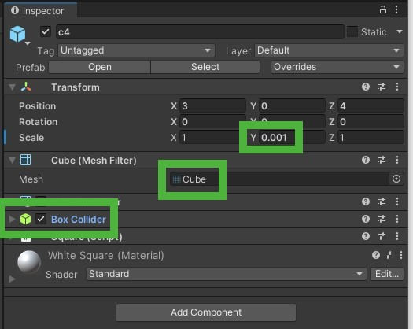
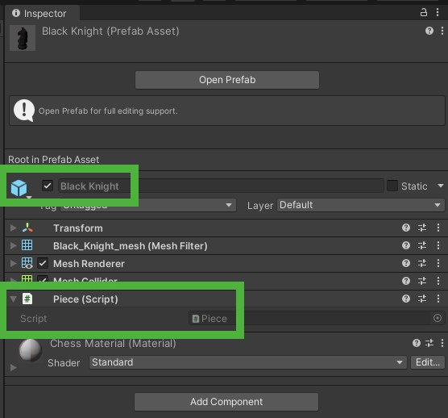
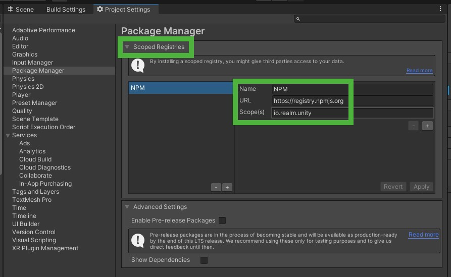

# Persistence in Unity using Realm

## Introduction

When creating a game with Unity we often reach the point where we need to save data that we need at a later point in time. This could be something simple like a table of high scores or a lot more complex like the state of the game that got paused and now needs to be resumed exactly the way the user left it when they quit it earlier. Maybe you have tried this before using `PlayerPrefs` but your data was too complex to save it in there. Or you have tried SQL only to find it to be very complicated and cumbersome to use.

Realm can help you achieve this easily and quickly with just some minor adjustments to your code.

The goal of this article is to show you how to add Realm to your Unity game and make sure your data is persisted. The Realm Unity SDK is part of our [Realm .NET SDK](https://github.com/realm/realm-dotnet). The [documentation for the Realm .NET SDK](https://docs.mongodb.com/realm/sdk/dotnet) will help you get started easily.

The first part of this tutorial will describe the example itself. If you are already familiar with Unity or really just want to see Realm in action you can also skip it and [jump straight to the second part](#add-realm).

## Example game

We will be using a simple 3D chess game for demonstration purposes. Creating this game itself will not be part of this tutorial. However, this section will provide you with an overview so that you can follow along and add Realm to the game. This example can be found in [our Unity examples repository](https://github.com/realm/unity-examples-3d-chess/tree/example-template).

The [final implementation of the game](https://github.com/realm/unity-examples-3d-chess/tree/local-realm) including the usage of Realm is also part of the example repository.


To make it easy to find your way around this example, here are some notes to get you started:

The interesting part in the `MainScene` to look at is the `Board` which is made up of `Squares` and `Pieces`. The `Squares` are just slightly scaled and colored default `Cube` objects which we utilize to visualize the `Board` but also detect clicks for moving `Pieces` by using it's already attached [`Box Collider`](https://docs.unity3d.com/Manual/class-BoxCollider.html) component.



The `Pieces` have to be activated first which happens by making them clickable as well. `Pieces` are not initially added to the `Board` but instead will be spawned by the `PieceSpawner`. You can find them in the `Prefabs` folder in the `Project` hierarchy.



The important part to look for here is the `Piece` script which detects clicks on this `Piece` (3) and offers a color change via `Select()` (1) and `Deselect()` (2) to visualize if a `Piece` is active or not.

```c#
using UnityEngine;

public class Piece : MonoBehaviour
{
    private Events events = default;
    private readonly Color selectedColor = new Color(1, 0, 0, 1);
    private readonly Color deselectedColor = new Color(1, 1, 1, 1);

    // 1
    public void Select()
    {
        gameObject.GetComponent<Renderer>().material.color = selectedColor;
    }

    // 2
    public void Deselect()
    {
        gameObject.GetComponent<Renderer>().material.color = deselectedColor;
    }

    // 3
    private void OnMouseDown()
    {
        events.PieceClickedEvent.Invoke(this);
    }

    private void Awake()
    {
        events = FindObjectOfType<Events>();
    }
}

```

We use two events to actually track the click on a `Piece` (1) or a `Square` (2):

```c#
using UnityEngine;
using UnityEngine.Events;

public class PieceClickedEvent : UnityEvent<Piece> { }
public class SquareClickedEvent : UnityEvent<Vector3> { }

public class Events : MonoBehaviour
{
    // 1
    public readonly PieceClickedEvent PieceClickedEvent = new PieceClickedEvent();
    // 2
    public readonly SquareClickedEvent SquareClickedEvent = new SquareClickedEvent();
}
```

The `InputListener` waits for those events to be invoked and will then notify other parts of our game about those updates. Pieces need to be selected when clicked (1) and deselected if another one was clicked (2).

Clicking a `Square` while a `Piece` is selected will send a message (3) to the `GameState` to update the position of this `Piece`.

```c#
using UnityEngine;

public class InputListener : MonoBehaviour
{
    [SerializeField] private Events events = default;
    [SerializeField] private GameState gameState = default;

    private Piece activePiece = default;

    private void OnEnable()
    {
        events.PieceClickedEvent.AddListener(OnPieceClicked);
        events.SquareClickedEvent.AddListener(OnSquareClicked);
    }

    private void OnDisable()
    {
        events.PieceClickedEvent.RemoveListener(OnPieceClicked);
        events.SquareClickedEvent.RemoveListener(OnSquareClicked);
    }

    private void OnPieceClicked(Piece piece)
    {
        if (activePiece != null)
        {
            // 2
            activePiece.Deselect();
        }
        // 1
        activePiece = piece;
        activePiece.Select();
    }

    private void OnSquareClicked(Vector3 position)
    {
        if (activePiece != null)
        {
            // 3
            gameState.MovePiece(activePiece, position);
            activePiece.Deselect();
            activePiece = null;
        }
    }
}

```

The actual movement as well as controlling the spawning and destroying of pieces is done by the `GameState` in which all the above information eventually comes together to update `Piece` positions and possibly destroy other `Piece` objects. Whenever we move a `Piece` (1) we not only update it's position (2) but also need to check if there is a `Piece` in that position already (3) and if so, destroy it (4).

In addition to updating the game while it is running the `GameState` offers two more functionalities:
- set up the initial board (5)
- reset the board to it's initial state (6)

```c#
using System.Linq;
using UnityEngine;

public class GameState : MonoBehaviour
{
    [SerializeField] private PieceSpawner pieceSpawner = default;
    [SerializeField] private GameObject pieces = default;

    // 1
    public void MovePiece(Piece movedPiece, Vector3 newPosition)
    {
        // 3
        // Check if there is already a piece at the new position and if so, destroy it.
        var attackedPiece = FindPiece(newPosition);
        if (attackedPiece != null)
        {
            // 4
            Destroy(attackedPiece.gameObject);
        }

        // 2
        // Update the movedPiece's GameObject.
        movedPiece.transform.position = newPosition;
    }

    // 6
    public void ResetGame()
    {
        // Destroy all GameObjects.
        foreach (var piece in pieces.GetComponentsInChildren<Piece>())
        {
            Destroy(piece.gameObject);
        }

        // Recreate the GameObjects.
        pieceSpawner.CreateGameObjects(pieces);
    }

    private void Awake()
    {
        // 5
        pieceSpawner.CreateGameObjects(pieces);
    }

    private Piece FindPiece(Vector3 position)
    {
        return pieces.GetComponentsInChildren<Piece>()
            .FirstOrDefault(piece => piece.transform.position == position);
    }
}
```

Go ahead and try it out yourself if you like. You can play around with the board and pieces and reset if you want to start all over again.

To make sure the example is not overly complex and easy to follow there are no rules implemented. You can move the pieces however you want. Also, the game is purely local for now and will be expanded using our Sync component in a later article to be playable online with others.

In the following section I will explain how to make sure that the current game state gets saved and the players can resume the game at any state.

## <a name="add-realm"></a>Adding Realm to your project

The first thing we need to do is to import the Realm framework into Unity.
The easiest way to do this is by using NPM.

You'll find it via `Windows` → `Package Manager` → cogwheel in the top right corner → `Advanced Project Settings`:


Within the `Scoped Registries` you can add the `Name`, `URL` and `Scope` as follows:



This adds `NPM` as a source for libraries. The final step is to tell the project which dependencies to actually integrate into the project. This is done in the `manifest.json` file which is located in the `Packages` folder of your project.

Here you need to add the following line to the `dependencies`:

```json
"io.realm.unity": "<version-number>"
```

Replace `<version-number>` with the most recent Realm version found in https://github.com/realm/realm-dotnet/releases and you're all set.

The final `manifest.json` should look something like this:

```json
{
 "dependencies": {
   ...
   "io.realm.unity": "10.3.0"
 },
 "scopedRegistries": [
   {
     "name": "NPM",
     "url": "https://registry.npmjs.org/",
     "scopes": [
       "io.realm.unity"
     ]
   }
 ]
}
```

When you switch back to Unity it will reload the dependencies. If you then open the `Package Manager` again, you should see `Realm` as a new entry in the list on the left:


We can now start using Realm in our Unity project.

## Top-down or bottom-up?

Before we actually start adding Realm to our code we need to think about how we want to achieve this and how the UI and database will interact with each other.

There are basically two options we can choose from: top-down or bottom-up.

The top-down approach would be to have the UI drive the changes. The `Piece` would know about it's database object and whenever a `Piece` is moved it would also update the database with it's new position.

The preferred approach would be bottom-up though. Changes will be applied to the Realm and it will then take care of whatever implications this has on the UI by sending notifications.

Let's first look into the initial setup of the board.

## Setting up the board

The first thing we want to do is to define a Realm representation of our Piece since we cannot save the `MonoBehaviour` directly in Realm. Classes that are supposed to be saved in Realm need to subclass `RealmObject`. The class `PieceEntity` will represent such an object. Note that we cannot just duplicate the types from `Piece` since [not all of them can be saved in Realm](https://docs.mongodb.com/realm/sdk/dotnet/data-types/field-types/), like `Vector3` and `enum`.

Add the following scripts to the project:

```c#
using Realms;
using UnityEngine;

public class PieceEntity : RealmObject
{
    // 1
    public PieceType PieceType
    {
        get => (PieceType)Type;
        private set => Type = (int)value;
    }

    // 2
    public Vector3 Position
    {
        get => PositionEntity.ToVector3();
        set => PositionEntity = new Vector3Entity(value);
    }

    // 3
    private int Type { get; set; }
    private Vector3Entity PositionEntity { get; set; }

    // 4
    public PieceEntity(PieceType type, Vector3 position)
    {
        PieceType = type;
        Position = position;
    }

    // 5
    protected override void OnPropertyChanged(string propertyName)
    {
        if (propertyName == nameof(PositionEntity))
        {
            RaisePropertyChanged(nameof(Position));
        }
    }

    // 6
    private PieceEntity()
    {
    }
}
```

```c#
using Realms;
using UnityEngine;

public class Vector3Entity : EmbeddedObject // 7
{
    public float X { get; private set; }
    public float Y { get; private set; }
    public float Z { get; private set; }

    public Vector3Entity(Vector3 vector) // 8
    {
        X = vector.x;
        Y = vector.y;
        Z = vector.z;
    }

    public Vector3 ToVector3() => new Vector3(X, Y, Z); // 9

    private Vector3Entity() // 10
    {
    }
}
```

Even though we cannot save the `PieceType` (1) and the position (2) directly in the Realm, we can still expose them using backing variables (3) to make working with this class easier while still fulfilling the requirements for saving data in Realm.

Additionally we provide a convenience constructor (4) for setting those two properties. A default constructor (6) also has to be provided for every `RealmObject`. Since we are not going to use it here though we can set it to `private`.

Note that one of these backing variables is a `RealmObject` itself, or rather a sub class of it: `EmbeddedObject` (7). By extracting the position to a separate class `Vector3Entity` the `PieceEntity` is more readable. Another plus is that we can use the `EmbeddedObject` to represent a 1:1 relationship. Every `PieceEntity` can only have one `Vector3Entity` and even more importantly, ever `Vector3Entity` can only belong to one `PieceEntity` because there can only every be one `Piece` on any given `Square`.

The `Vector3Entity`, like the `PieceEntity`, has some convenience functionality like a constructor that takes a `Vector3` (8), the `ToVector3()` function (9) and the private, mandatory default constructor (10) like `PieceEntity`.

Looking back at the `PieceEntity` you will notice one more function: `OnPropertyChanged` (5). Realm sends notifications for changes to fields saved in the database. Since we expose those fields using `PieceType` and `Position` we need to make sure those notifications are passed on. This is achieved by calling `RaisePropertyChanged(nameof(Position));` whenever `PositionEntity` changes.

The next step is to add some way to actually add `Pieces` to the `Realm`. The current database state will always represent the current state of the board. When we create a new `PieceEntity`, for example when setting up the board, the `GameObject` for it (`Piece`) will be created. If a `Piece` gets moved, the `PieceEntity` will be updated by the `GameState` which then leads to the `Piece`'s `GameObject` being updated using above mentioned notifications.

First, we will need to set up the board. To achieve this using the bottom-up approach we adjust the `PieceSpawner` as follows:

```c#
using Realms;
using UnityEngine;

public class PieceSpawner : MonoBehaviour
{
    [SerializeField] private Piece prefabBlackBishop = default;
    [SerializeField] private Piece prefabBlackKing = default;
    [SerializeField] private Piece prefabBlackKnight = default;
    [SerializeField] private Piece prefabBlackPawn = default;
    [SerializeField] private Piece prefabBlackQueen = default;
    [SerializeField] private Piece prefabBlackRook = default;

    [SerializeField] private Piece prefabWhiteBishop = default;
    [SerializeField] private Piece prefabWhiteKing = default;
    [SerializeField] private Piece prefabWhiteKnight = default;
    [SerializeField] private Piece prefabWhitePawn = default;
    [SerializeField] private Piece prefabWhiteQueen = default;
    [SerializeField] private Piece prefabWhiteRook = default;

    public void CreateNewBoard(Realm realm)
    {
        realm.Write(() =>
        {
            // 1
            realm.RemoveAll<PieceEntity>();

            // 2
            realm.Add(new PieceEntity(PieceType.WhiteRook, new Vector3(1, 0, 1)));
            realm.Add(new PieceEntity(PieceType.WhiteKnight, new Vector3(2, 0, 1)));
            realm.Add(new PieceEntity(PieceType.WhiteBishop, new Vector3(3, 0, 1)));
            realm.Add(new PieceEntity(PieceType.WhiteQueen, new Vector3(4, 0, 1)));
            realm.Add(new PieceEntity(PieceType.WhiteKing, new Vector3(5, 0, 1)));
            realm.Add(new PieceEntity(PieceType.WhiteBishop, new Vector3(6, 0, 1)));
            realm.Add(new PieceEntity(PieceType.WhiteKnight, new Vector3(7, 0, 1)));
            realm.Add(new PieceEntity(PieceType.WhiteRook, new Vector3(8, 0, 1)));

            realm.Add(new PieceEntity(PieceType.WhitePawn, new Vector3(1, 0, 2)));
            realm.Add(new PieceEntity(PieceType.WhitePawn, new Vector3(2, 0, 2)));
            realm.Add(new PieceEntity(PieceType.WhitePawn, new Vector3(3, 0, 2)));
            realm.Add(new PieceEntity(PieceType.WhitePawn, new Vector3(4, 0, 2)));
            realm.Add(new PieceEntity(PieceType.WhitePawn, new Vector3(5, 0, 2)));
            realm.Add(new PieceEntity(PieceType.WhitePawn, new Vector3(6, 0, 2)));
            realm.Add(new PieceEntity(PieceType.WhitePawn, new Vector3(7, 0, 2)));
            realm.Add(new PieceEntity(PieceType.WhitePawn, new Vector3(8, 0, 2)));

            realm.Add(new PieceEntity(PieceType.BlackPawn, new Vector3(1, 0, 7)));
            realm.Add(new PieceEntity(PieceType.BlackPawn, new Vector3(2, 0, 7)));
            realm.Add(new PieceEntity(PieceType.BlackPawn, new Vector3(3, 0, 7)));
            realm.Add(new PieceEntity(PieceType.BlackPawn, new Vector3(4, 0, 7)));
            realm.Add(new PieceEntity(PieceType.BlackPawn, new Vector3(5, 0, 7)));
            realm.Add(new PieceEntity(PieceType.BlackPawn, new Vector3(6, 0, 7)));
            realm.Add(new PieceEntity(PieceType.BlackPawn, new Vector3(7, 0, 7)));
            realm.Add(new PieceEntity(PieceType.BlackPawn, new Vector3(8, 0, 7)));

            realm.Add(new PieceEntity(PieceType.BlackRook, new Vector3(1, 0, 8)));
            realm.Add(new PieceEntity(PieceType.BlackKnight, new Vector3(2, 0, 8)));
            realm.Add(new PieceEntity(PieceType.BlackBishop, new Vector3(3, 0, 8)));
            realm.Add(new PieceEntity(PieceType.BlackQueen, new Vector3(4, 0, 8)));
            realm.Add(new PieceEntity(PieceType.BlackKing, new Vector3(5, 0, 8)));
            realm.Add(new PieceEntity(PieceType.BlackBishop, new Vector3(6, 0, 8)));
            realm.Add(new PieceEntity(PieceType.BlackKnight, new Vector3(7, 0, 8)));
            realm.Add(new PieceEntity(PieceType.BlackRook, new Vector3(8, 0, 8)));
        });
    }

    public void SpawnPiece(PieceEntity pieceEntity, GameObject parent)
    {
        var piecePrefab = pieceEntity.PieceType switch
        {
            PieceType.BlackBishop => prefabBlackBishop,
            PieceType.BlackKing => prefabBlackKing,
            PieceType.BlackKnight => prefabBlackKnight,
            PieceType.BlackPawn => prefabBlackPawn,
            PieceType.BlackQueen => prefabBlackQueen,
            PieceType.BlackRook => prefabBlackRook,
            PieceType.WhiteBishop => prefabWhiteBishop,
            PieceType.WhiteKing => prefabWhiteKing,
            PieceType.WhiteKnight => prefabWhiteKnight,
            PieceType.WhitePawn => prefabWhitePawn,
            PieceType.WhiteQueen => prefabWhiteQueen,
            PieceType.WhiteRook => prefabWhiteRook,
            _ => throw new System.Exception("Invalid piece type.")
        };

        var piece = Instantiate(piecePrefab, pieceEntity.Position, Quaternion.identity, parent.transform);
        piece.Entity = pieceEntity;
    }
}
```

The important change here is `CreateNewBoard`. Instead of spawning the `Piece`s we now add `PieceEntity` objects to the Realm. When we look at the changes in `GameState` we will see how this actually creates a `Piece` per `PieceEntity`.

Here we just wipe the database (1) and then add new `PieceEntity` objects (2). Note that this is wrapped by a `realm.write` block. Whenever we want to change the database we need to enclose it in a write transaction. This makes sure that no other piece of code can change the database at the same time since transactions block each other.

The last step to create a new board is to update the `GameState` to make use of the new `PieceSpawner` and the `PieceEntity` that we just created.

We'll go through these changes step by step. First we also need to import Realm here as well:

```c#
using Realms;
```

Then we add a private field to save our `Realm` instance to avoid creating it over and over again. We also create another private field to save the collection of pieces that are on the board and a notification token which we need for above mentioned notifications:

```c#
private Realm realm;
private IQueryable<PieceEntity> pieceEntities;
private IDisposable notificationToken;
```

In `Awake` we do need to get access to the `Realm`. This is achieved by opening an instance of it (1) and then asking it for all `PieceEntity` objects currently saved using `realm.All` (2) and assigning them to our `pieceEntities` field:

```c#
private void Awake()
{
    realm = Realm.GetInstance(); // 1
    pieceEntities = realm.All<PieceEntity>(); // 2

    // 3
    notificationToken = pieceEntities.SubscribeForNotifications((sender, changes, error) =>
    {
        // 4
        if (error != null)
        {
            Debug.Log(error.ToString());
            return;
        }

        // 5
        // Initial notification
        if (changes == null)
        {
            // Check if we actually have `PieceEntity` objects in our Realm (which means we resume a game).
            if (sender.Count > 0)
            {
                // 6
                // Each `RealmObject` needs a corresponding `GameObject` to represent it.
                foreach (PieceEntity pieceEntity in sender)
                {
                    pieceSpawner.SpawnPiece(pieceEntity, pieces);
                }
            }
            else
            {
                // 7
                // No game was saved, create a new board.
                pieceSpawner.CreateNewBoard(realm);
            }
            return;
        }

        // 8
        foreach (var index in changes.InsertedIndices)
        {
            var pieceEntity = sender[index];
            pieceSpawner.SpawnPiece(pieceEntity, pieces);
        }
    });
}
```

Note that collections are live objects. This has two positive implications: Every access to the object reference always returns an updated representation of said object. Because of this, every subsequent change to the object will be visible any time the object is accessed again. We also get notifications for those changes if we subscribed to them. This can be done by calling `SubscribeForNotifications` on a collection (3).

Apart from an error object that we need to check (4) we also receive the `changes` and the `sender` (the updated collection itself) with every notification. For every new collection of objects an initial notification is sent that does not include any `changes` but gives us the opportunity to do some initial setup work (5).

In case we resume a game, we'll already see `PieceEntity` objects in the database even for the initial notification. We need to spawn one `Piece` per `PieceEntity` to represent it (6). We make use of the `SpawnPiece` function in `PieceSpawner` to achieve this. In case the database does not have any objects yet, we need to create the board from scratch (7). Here we use the `CreateNewBoard` function we added earlier to the `PieceSpawner`.

On top of the initial notification we also expect to receive a notification every time a `PieceEntity` is inserted into the Realm. This is where we continue the `CreateNewBoard` functionality we started in the `PieceSpawner` by adding new objects to the database. After those changes happened we end up with `changes` (8) inside the notifications. Now we need to iterate over all new `PieceEntity` objects in the `sender` (which represents the `pieceEntities` collection) and add a `Piece` for each new `PieceEntity` to the board.

Apart from inserting new pieces when the board gets set up we also need to take care of movement and pieces attacking each other. This will be explained in the next section.

## Updating the position of a PieceEntity

Whenever we receive a click on a `Square` and therefore call `MovePiece` in `GameState` we now need to update the `PieceEntity` instead of directly moving the corresponding `GameObject`. The movement of the `Piece` will then happen via the `PropertyChanged` notifications as we've seen earlier.

```c#
public void MovePiece(Vector3 oldPosition, Vector3 newPosition)
{
    realm.Write(() =>
    {
        // 1
        var attackedPiece = FindPieceEntity(newPosition);
        if (attackedPiece != null)
        {
            realm.Remove(attackedPiece);
        }

        // 2
        var movedPieceEntity = FindPieceEntity(oldPosition);
        movedPieceEntity.Position = newPosition;
    });
}

// 3
private PieceEntity FindPieceEntity(Vector3 position)
{
    return pieceEntities
             .Filter("PositionEntity.X == $0 && PositionEntity.Y == $1 && PositionEntity.Z == $2",
                     position.x, position.y, position.z)
             .FirstOrDefault();
}
```

Before actually moving the `PieceEntity` we do need to check if there is already a `PieceEntity` at the desired position and if so, destroy it. To find a `PieceEntity` at the `newPosition` and also to find the `PieceEntity` that needs to be moved from `oldPosition` to `newPosition` we can use queries on the `pieceEntities` collection (3).

By querying the collection (calling `Filter`) we can look for one or multiple `RealmObject`s with specific characteristics. In this case we're interested in the `RealmObject` that represents the `Piece` we are looking for. Note that when using a `Filter` we can only filter using the Realm properties saved in the database, not the exposed properties (`Position` and `PieceType`) exposed for convenience by the `PieceEntity`.

If there is an `attackedPiece` at the target position we need to delete the corresponding `PieceEntity` for this `GameObject` (1). After the `attackedPiece` was updated we can then also update the `movedPiece` (2).

Like the initial setup of the board, this has to be called within a write transaction to make sure no other code is changing the database at the same time.

This is all we had to do to update and persist the position. Go ahead and start the game. Stop and start it again and you should now see the state being persisted.

## Resetting the board

The final step will be to also update our `ResetGame` button to update (or rather: wipe) the `Realm`. At the moment it does not update the state in the database and just re-creates the `GameObject`s.

Resetting works similar to what we do in `Awake` in case there were no entries in the database, for example when starting the game for the first time.

We can re-use the `CreateNewBoard` functionality here since it includes wiping the database before actually re-creating it:

```c#
public void ResetGame()
{
    pieceSpawner.CreateNewBoard(realm);
}
```

With this change our game is finished and fully functional using a local `Realm` to save the game's state.

## Recap and Conclusion

In this tutorial we have seen that saving your game and resuming it later can be easily achieved by using `Realm`.

The steps we needed to take:

- Add `Realm` via NPM as a dependency.
- Import `Realm` in any class that wants to use it by calling `using Realms;`.
- Create a new `Realm` instance via `Realm.GetInstance()` to get access to the database.
- Define entites by subclassing `RealmObject` (or any of it's sub classes):
  - Fields need to be public and primitive values or lists.
  - A default constructor is mandatory.
  - A convenience constructor and additional functions can be defined.
- Write to a `Realm` using `realm.Write()` to avoid data corruption.
- CRUD operations (need to use a `write` transaction):
  - Use `realm.Add()` to `Create` a new object.
  - Use `realm.Remove()` to `Delete` an object.
  - `Read` and `Update` can be achieved by simply `getting` and `setting` the `public fields`.

With this you should be ready to use Realm in your games.

If you have questions, please head to our [developer community website](https://community.mongodb.com) where the MongoDB engineers and the MongoDB community will help you build your next big idea with MongoDB and Realm.
