# Turning your local game into an online experience with MongoDB Realm Sync

## Introduction

Playing a game locally can be fun at times. But there is nothing more exciting than playing with or against the whole world. Using Realm Sync you can easily synchronize data between multiple instances and turn your local game into an online experience.

In [a previous tutorial](https://github.com/realm/unity-examples/blob/3d-chess/local-realm/tutorial/unity_local_realm.md) we showed how to use Realm locally to persist your game's data. We will build on the local Realm to show how to easily transition to Realm Sync.

If you have not used local Realms before we recommend working through the previous tutorial first so you can easily follow along here when we build on them.

You can find the local Realm example that this tutorial is based on in [our example repository at Github](https://github.com/realm/unity-examples/tree/3d-chess/local-realm) and use it to follow along.

The [final of result of this tutorial](https://github.com/realm/unity-examples/tree/3d-chess/synced-realm) can also be found in the examples reposity.

## MongoDB Realm Sync and MongoDB Atlas

The local Realm database we have seen in the previous tutorial is one of three components we need to synchronize data between multiple instances of our game. The other two are [MongoDB Atlas](https://www.mongodb.com/cloud/atlas) and [MongoDB Realm Sync](https://www.mongodb.com/realm).

We will use Atlas as our backend and cloud-based database. Realm Sync on the other side enables sync between your local Realm database and Atlas, seamlessly stitching together the two components into an application layer for your game. To support these services, MongoDB Realm also provides [components to fulfill several common application requirements](https://docs.mongodb.com/realm/get-started/introduction-mobile/#mongodb-realm) from which we will be using the [Realm Users and Authentication](https://docs.mongodb.com/realm/authentication/) feature to register and login the user.

There are a couple of things we need to prepare in order to enable synchronisation in our app. You can find an overview on [how to get started with MongoDB Realm Sync](https://docs.mongodb.com/realm/sync/get-started/#std-label-enable-sync) in the documentation. Here are the steps we need to take:

- [Create an Atlas account](https://www.mongodb.com/cloud/atlas/register?tck=docs_realm)
- [Create a Realm App](https://docs.mongodb.com/realm/manage-apps/create/create-with-realm-ui/#std-label-create-a-realm-app)
- [Enable Sync](https://docs.mongodb.com/realm/sync/rules/#std-label-sync-rules)
- [Enable Developer Mode](https://docs.mongodb.com/realm/sync/enable-development-mode/#std-label-enable-development-mode)
- [Enable email registration](https://docs.mongodb.com/realm/authentication/email-password/) and choose `Automatically confirm users` under `User Confirmation Method`

## Example

We will build on the local Realm example we created in the previous tutorial using the 3D chess game. To get you started easily you can find the final result in our [examples reposity](https://github.com/realm/unity-examples/tree/3d-chess/local-realm) (branch: `local-realm`).

The local Realm is based on four building blocks:

- `PieceEntity`
- `Vector3Entity`
- `PieceSpawner`
- `GameState`

The `PieceEntity` along with the `Vector3Entity` represents our model which include the two properties that make up a chess piece: type and position.

```cs
...

public class PieceEntity : RealmObject
{
    public PieceType PieceType
    {
        ...
    }

    public Vector3 Position
    {
        ...
    }
    ...
}
```

In the previous tutorial we have also added functionality to persist changes in position to the Realm and react to changes in the database that have to be reflected in the model. This was done by implementing `OnPropertyChanged` in the `Piece` and `PieceEntity` respectively.

The `PieceSpawner` is responsible for spawning new `Piece` objects when the game starts via `public void CreateNewBoard(Realm realm)`. Here we can see some of the important functions that we need when working with Realm:

- `Write`: Starts a new write transaction which is necessary to change the state of the database.
- `Add`: Adds a new `RealmObject` to the database that has not been there before.
- `RemoveAll`: Removes all objects of a specified type from the database.

All of this comes together in the central part of the game that manages the flow of it: `GameState`. The `GameState` open the Realm using `Realm.GetInstance()` in `Awake` and offers an option to move pieces via `public void MovePiece(Vector3 oldPosition, Vector3 newPosition)` which also checks if a `Piece` already exists at the target location. Furthermore we subscribe for notifications to set up the initial board. One of the things we will be doing in this tutorial is to expand on this subscription mechanic to also react to changes that come in through Realm Sync.

## Extending the model

The first thing we need to change to get the local Realm example ready for Sync is to [add a PrimaryKey to the PieceType](https://docs.mongodb.com/realm/sdk/dotnet/quick-start-with-sync/#define-your-object-model). This is a mandatory requirement for Sync to make sure objects can be distinguished from each other. We will be using the field `Id` here. Note that you can add a `MapTo` attribute in case the name of the field in the `RealmObject` differs from the name set in Atlas. By default the primary key is named `_id` in Atlas which would conflict with the .NET coding guidelines. By adding `[MapTo("_id")]` we can address this fact.

```cs
using MongoDB.Bson;
```

```cs
[PrimaryKey]
[MapTo("_id")]
public ObjectId Id { get; set; } = ObjectId.GenerateNewId();
```

## Who am I playing with?

The local Realm tutorial showed you how to create a persisted game locally. While you could play with someone else using the same game client, there was only ever one game running at a time since every game is accessing the same table in the database and therefore the same objects.

This would still be the same when using Realm Sync if we do not separate those games. Everyone accessing the game from wherever they are would see the same state. We need a way to create multiple games and identify which one we are playing. Realm Sync offers a feature that let's us achieve exactly this: [partitions](https://docs.mongodb.com/realm/sync/partitions/).

> A partition represents a subset of the documents in a synced cluster that are related in some way and have the same read/write permissions for a given user. Realm directly maps partitions to individual synced .realm files so each object in a synced realm has a corresponding document in the partition.

What does this mean for our game? If we use one partition per match we can make sure that only players using the same partition will actually play the same game. Furthermore, we can start as many games as we want. Using the same partition simply means using the same `partiton key` when opening a synced Realm. Partition keys are restricted to the following types: `String`, `ObjectID`, `Guid`, `Long`.

For our game we will use a string that we ask the user for when they start the game. We will do this by adding a new scene to the game which also acts as a welcome and loading scene.

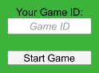

Go to `Assets -> Create -> Scene` to create a new scene and name it `WelcomeScene`. Double click it to activate it.

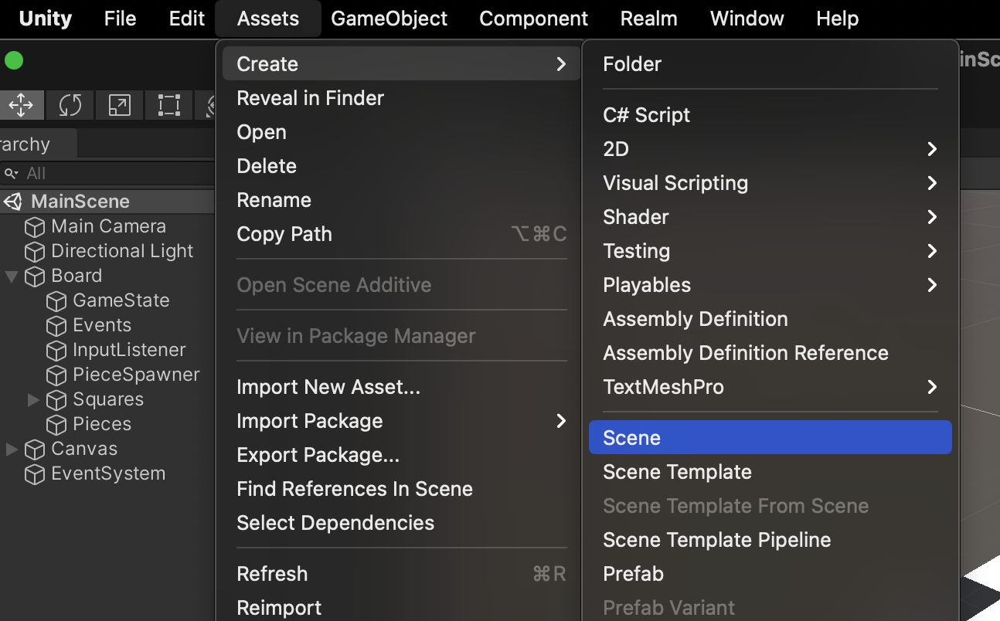

Using `GameObject -> UI` we then add `Text`, `Input Field` and `Button` to the new scene. The input will be our partition key. To make it easier to understand for the player we will call its placeholder `game id`. The `Text` object can be set to `Your Game ID:` and the button's text to `Start Game`. Make sure to reposition them to your liking.

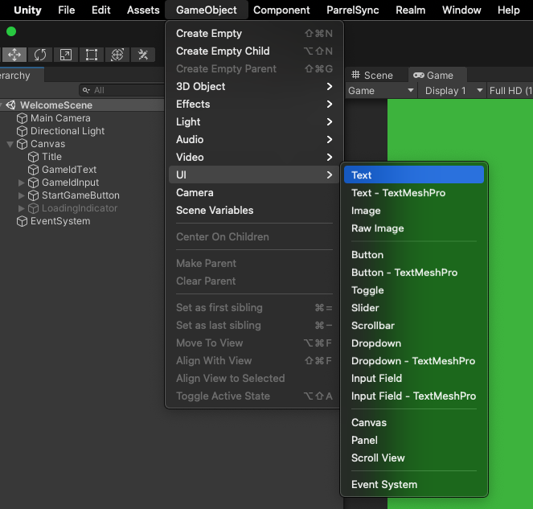

## Getting everything in Sync

Add a script to the button called `StartGameButton` by clicking `Add Component` in the Inspector with the start button selected. Then select `script` and type in its name.

```cs
using Realms;
using Realms.Sync;
using System;
using System.IO;
using System.Threading.Tasks;
using UnityEngine;
using UnityEngine.SceneManagement;
using UnityEngine.UI;

public class StartGameButton : MonoBehaviour
{
    [SerializeField] private GameObject loadingIndicator = default; // 1
    [SerializeField] private InputField gameIdInputField = default; // 2

    public async void OnStartButtonClicked() // 3
    {
        loadingIndicator.SetActive(true); // 4

        // 5
        var gameId = gameIdInputField.text;
        PlayerPrefs.SetString(Constants.PlayerPrefsKeys.GameId, gameId);

        await CreateRealmAsync(gameId); // 5

        SceneManager.LoadScene(Constants.SceneNames.Main); // 13
    }
    
    private async Task CreateRealmAsync(string gameId)
    {
        var app = App.Create(Constants.Realm.AppId); // 6
        var user = app.CurrentUser; // 7

        if (user == null) // 8
        {
            // This example focuses on an introduction to Sync.
            // We will keep the registration simple for now by just creating a random email and password.
            // We'll also not create a separate registration dialog here and instead just register a new user every time.
            // In a different example we will focus on authentication methods, login / registration dialogs, etc.
            var email = Guid.NewGuid().ToString();
            var password = Guid.NewGuid().ToString();
            await app.EmailPasswordAuth.RegisterUserAsync(email, password); // 9
            user = await app.LogInAsync(Credentials.EmailPassword(email, password)); // 10
        }

        RealmConfiguration.DefaultConfiguration = new SyncConfiguration(gameId, user);

        if (!File.Exists(RealmConfiguration.DefaultConfiguration.DatabasePath)) // 11
        {
            // If this is the first time we start the game, we need to create a new Realm and sync it.
            // This is done by `GetInstanceAsync`. There is nothing further we need to do here.
            // The Realm is then used by `GameState` in it's `Awake` method.
            using var realm = await Realm.GetInstanceAsync(); // 12
        }
    }
}
```

The `StartGameButton` knows two other game objects: the `gameIdInputField` (1) that we created above and a `loadingIndicator` (2) that we will be creating in a moment. If offers one action that will be executed when the button is clicked: `OnStartButtonClicked` (3).

First, we want to show a loading indicator (4) in case loading the game takes a moment. Next we grab the `gameId` from the `InputField` and save it using the [`PlayerPrefs`](https://docs.unity3d.com/ScriptReference/PlayerPrefs.html). Saving data using the `PlayerPrefs` is acceptable if it is user input that does not need to be saved safely and only has a simple structure since `PlayerPrefs` can only take a limited set of data types: `string`, `float`, `int`.

Next, we need to create a Realm (5). Note that this is done asynchrounously using `await`. There are a couple of components necessary for opening a synced Realm:

- `app`: An instance of `App` (6) represents your Realm App that you created in Atlas. Therefore we need to pass the `app id` in here.
- `user`: If a user has been logged in before, we can access them by using `app.CurrentUser` (7). In case there has not been a successful login before this variable will be null (8) and we need to register a new user.

The actual values for `email` and `password` are not really relevant for this example. In your game you would use more `Input Field` objects to ask the user for this data. Here we can just use `Guid` to generate random values. Using `EmailPasswordAuth.RegisterUserAsync` offered by the `App` class we can then register the user (9) and finally log them in (10) using these credentials. Note that we need to await this asynchrounous call again.

When we are done with the login, all we need to do is to create a new `SyncConfiguration` with the `gameId` (which acts as our partition key) and the `user` and save it as the `RealmConfiguration.DefaultConfiguration`. This will make sure whenever we open a new Realm, we will be using this `user` and `partitionKey`.

Finally we want to open the Realm and synchronize it to get it ready for the game. We can detect if this is the first start of the game simply by checking if a Realm file for the given coonfiguration already exists or not (11). If there is no such file we open a Realm using `Realm.GetInstanceAsync()` (12) which automatically uses the `DefaultConfiguration` that we set before.

When this is done, we can load the main scene (13) using the `SceneManager`. Note that the name of the main scene was extracted into a file called `Constants` in which we also added the app id and the key we use to save the `game id` in the `PlayerPrefs`. You can either add another class in your IDE or in Unity (using `Assets -> Create -> C# Script`).

```cs
sealed class Constants
{
    public sealed class Realm
    {
        public const string AppId = "insert your Realm App ID here";
    }

    public sealed class PlayerPrefsKeys
    {
        public const string GameId = "GAME_ID_KEY";
    }

    public sealed class SceneNames
    {
        public const string Main = "MainScene";
    }
}
```

One more thing we need to do is adding the main scene in the build settings, otherwise the `SceneManager` will not be able to find it. Go to `File -> Build Settings ...` and click `Add Open Scenes` while the `MainScene` is open.

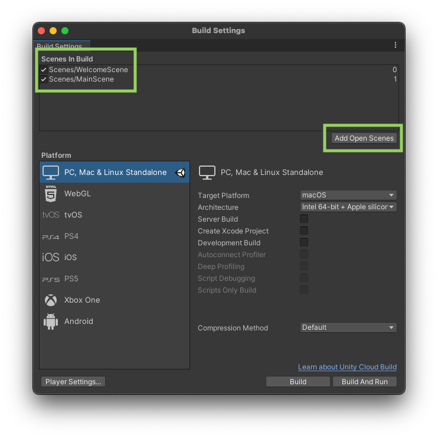

With these adjustments we are ready to synchronize data. Let's add the loading indicator to improve the user experience before we start and test our game.

## Loading Indicator

As mentioned before we want to add a loading indicator while the game is starting up. Don't worry, we will keep it simple since it is not the focus of this tutorial. We will just be using a simple `Text` and an `Image` which can both be found in the same `UI` sub menu we used above.


The make sure things are a bit more organised, embed both of them into another `GameObject` using `GameObject -> Create Empty`.

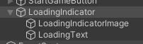

You can arrange and style the UI elements to your liking and when you're done just add a script to the `LoadingIndicatorImage`:

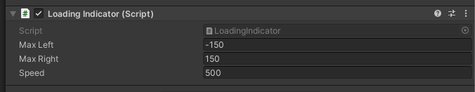

The script itself should look like this:

```cs
using UnityEngine;

public class LoadingIndicator : MonoBehaviour
{
    // 1
    [SerializeField] private float maxLeft = -150;
    [SerializeField] private float maxRight = 150;
    [SerializeField] private float speed = 100;

    // 2
    private enum MovementDirection { None, Left, Right }
    private MovementDirection movementDirection = MovementDirection.Left;

    private void Update()
    {
        switch (movementDirection) // 3
        {
            case MovementDirection.None:
                break;
            case MovementDirection.Left:
                transform.Translate(speed * Time.deltaTime * Vector3.left);
                if (transform.localPosition.x <= maxLeft) // 4
                {
                    transform.localPosition = new Vector3(maxLeft, transform.localPosition.y, transform.localPosition.z); // 5
                    movementDirection = MovementDirection.Right; // 6
                }
                break;
            case MovementDirection.Right:
                transform.Translate(speed * Time.deltaTime * Vector3.right);
                if (transform.localPosition.x >= maxRight) // 4
                {
                    transform.localPosition = new Vector3(maxRight, transform.localPosition.y, transform.localPosition.z); // 5
                    movementDirection = MovementDirection.Left; // 6
                }
                break;
        }
    }
}
```

The loading indicator that we will be using for this example is just a simple square moving sideways to indicate progress. There are two fields (1) we are going to expose to the Unity Editor by using `SerializeField` so that you can adjust these values while seing the indicator move. `maxMovement` will tell the indicator how far to move to the left and right from the original position. `speed` - as the name indicates - will determine how fast the indicator moves. The initial movement direction (2) is set to left, with `Vector3.Left` and `Vector3.Right` being the options given here.

The movement itself will be calculated in `Update()` which is run every frame. We basically just want to do one of two things:

- Move the loading indicator to the left until it reaches the left boundary, then swap the movement direction.
- Move the loading indicator to the right until it reaches the right boundary, then swap the movement direction.

Using the [`transform`](https://docs.unity3d.com/ScriptReference/Transform.html) component of the `GameObject` we can move it by calling `Translate`. The movement consists of the direction (`Vector3.left` or `Vector3.right`), the speed (set via the Unity Editor) and `Time.deltaTime` which represents the time since the last frame. The latter makes sure we see a smooth movement no matter what the frame time is. After moving the square we check (3) if we have reached the boundary and if so, set the position to this boundary (4). This is just to make sure the indicator does not visibly slip out of bounds in case we see a low frame rate. Finally the position is swapped (5).

The loading indicator will only be shown when the start button is clicked. The script above takes care of showing it. We need to disable it so that it does not show up before. This can be done by clicking the checkbox next to the name of the `LoadingIndicator` parent object in the Inspector.

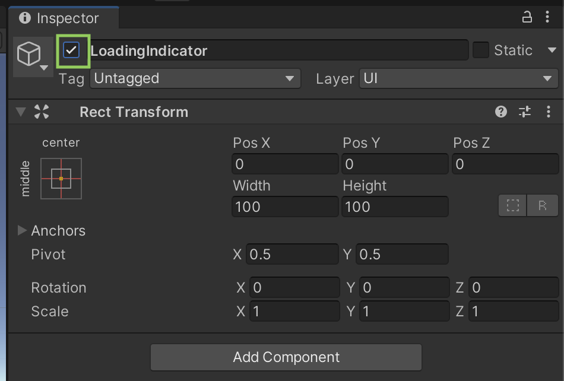

## Connecting UI and code

The scripts we have written above are finished but still need to be connected to the UI so that it can act on it.

First, let's assign the action to the button. With the `StartGameButton` selected in the `Hierarchy` open the `Inspector` and scroll down to the `On Click ()` area. Click the plus icon in the lower right to add a new on click action.

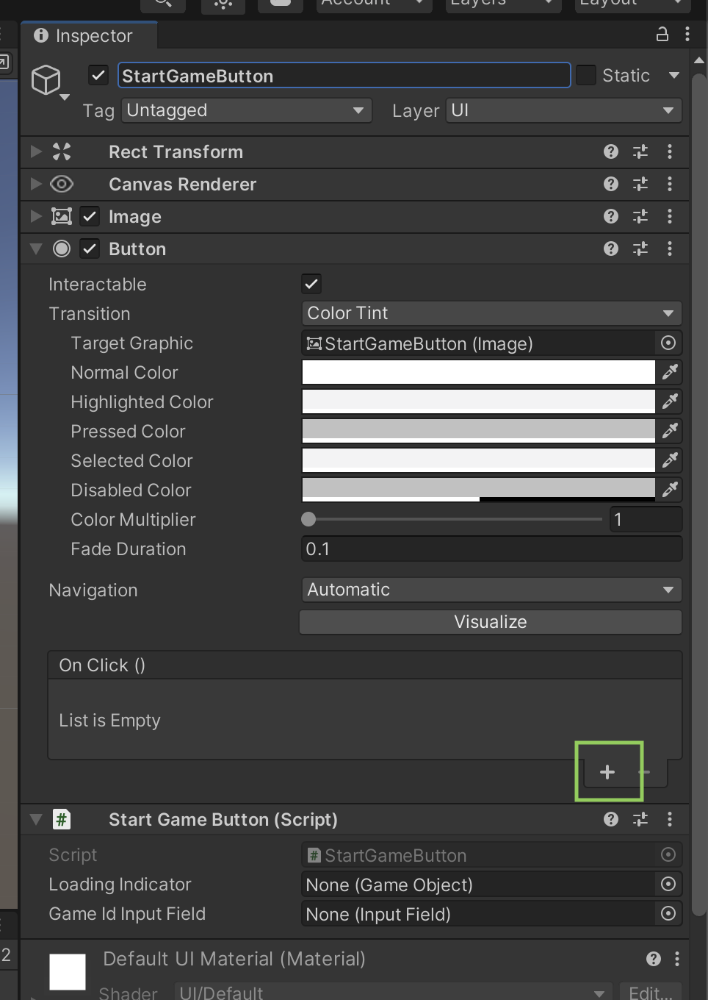

Next, drag and drop the `StartGameButton` from the `Hierarchy` onto the new action. This tells Unity which `GameObject` to use to look for actions that can be executed (which are functions that we implement like `OnStartButtonClicked()`).

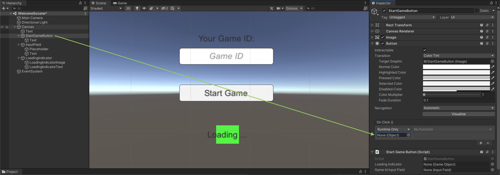

Finally, we can choose the action that should be assigned to the `On Click ()` event by opening the drop down. Choose the `StartGameButton` and then `OnStartButtonClicked ()`.

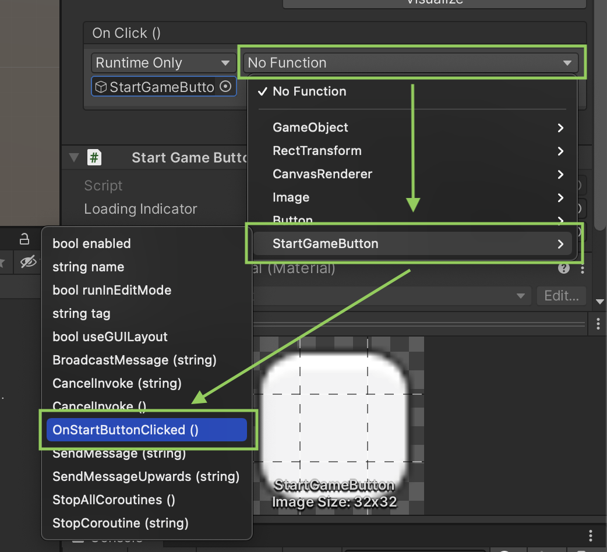

We also need to connect the input field and the loading indicator to the `StartGameButton` script so that it can access those. This is done via drag&drop again as before.

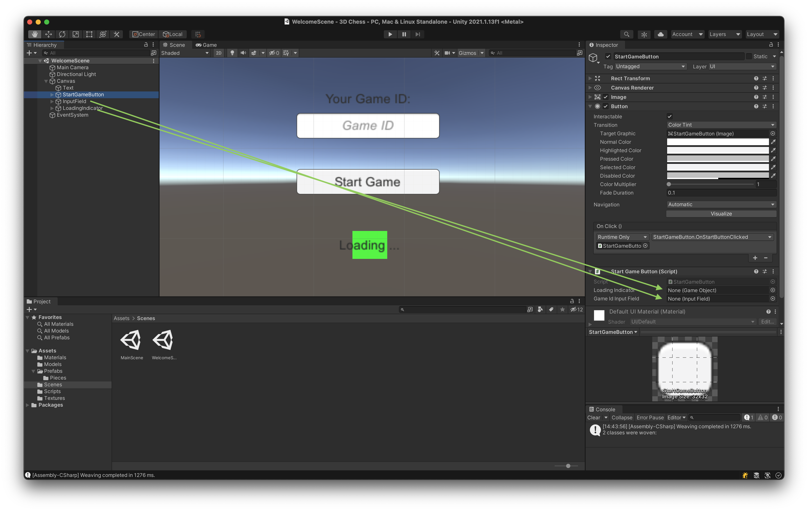

## Let's play!

Now that the loading indicator is added the game is finished and we can start and run it. Go ahead and try it!

You will notice the experience when using one local Unity instance with Sync is the same as it was in the local Realm version. To actually test multiple game instances you can open the project on another computer. An easier way to test multiple Unity instances is [ParallelSync](https://github.com/VeriorPies/ParrelSync). After following the installation instruction you will find a new menu item `ParallelSync` which offers a `Clones Manager`.

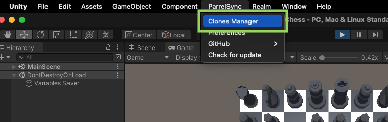

Within the `Clones Manager` you add and open a new clone by clicking `Add new clone` and `Open in New Editor`.

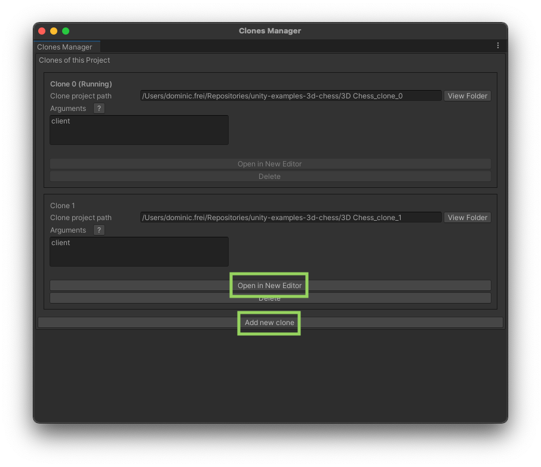

Using both instances you can then test the game and Realm Sync.

Remember that you need to use the same `game id` / `partition key` to join the same game with both instances.

Have fun!

## Recap and Conclusion

In this tutorial we have learned how to turn a game with a local Realm into a multiplayer experience using MongoDB Realm Sync. Let's summarise what needed to be done:

- Create an Atlas account and a Realm App therein
- Enable Sync, an authentication method and development mode
- Make sure every `RealmObject` has an `_id` field
- Choose a partition strategy (in this case: use the `partition key` to identify the match)
- Open a Realm using the `SyncConfiguration` (which incorporates the `App` and `User`)

The code for all of this can be found in [our example repository](https://github.com/realm/unity-examples/tree/3d-chess/synced-realm).

If you have questions, please head to our [developer community website](https://community.mongodb.com) where the MongoDB engineers and the MongoDB community will help you build your next big idea with MongoDB and Realm.
