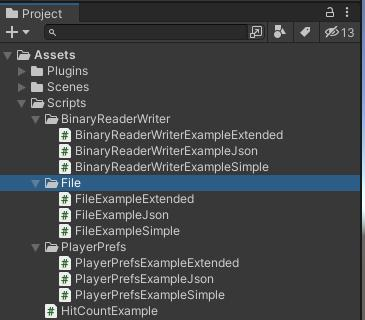
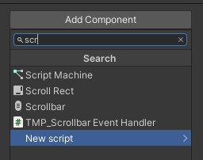
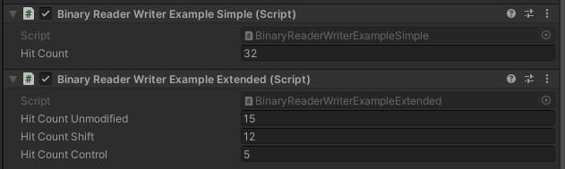
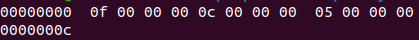
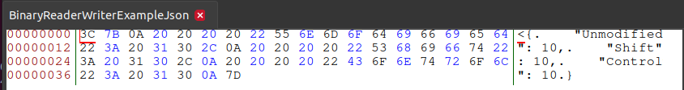

# Saving Data in Unity3D Using BinaryReader and BinaryWriter
<b>(Part 3 of the Persistence Comparison Series)</b>

## Introduction

Persisting data is an important part of most games. Unity offers only a limited set of solutions, which means we have to look around for other options as well.

In Part 1 of this series, we explored Unity's own solution: `PlayerPrefs`. This time, we look into one of the ways we can use the underlying .NET framework by saving files. Here is an overview of the complete series:

- Part 1: [PlayerPrefs](https://github.com/realm/unity-examples/blob/persistence-comparison/tutorials/persistance-comparison-series/PlayerPrefs/player_prefs.md)
- Part 2: [Files](https://github.com/realm/unity-examples/blob/persistence-comparison/tutorials/persistance-comparison-series/File/file.md)
- Part 3: BinaryReader and BinaryWriter *(this tutorial)*
- Part 4: SQL *(coming soon)*
- Part 5: Realm Unity SDK
- Part 6: Comparison of all those options

Like Part 1 and 2, this tutorial can also be found in the https://github.com/realm/unity-examples repository on the [persistence-comparison](https://github.com/realm/unity-examples/tree/persistence-comparison) branch.



Each part is sorted into a folder. The three scripts we will be looking at are in the `BinaryReaderWriter` sub folder. But first, let's look at the example game itself and what we have to prepare in Unity before we can jump into the actual coding.

## Example game

*Note that if you have worked through any of the other tutorials in this series, you can skip this section since we are using the same example for all parts of the series so that it is easier to see the differences between the approaches.*

The goal of this tutorial series is to show you a quick and easy way to make some first steps in the various ways to persist data in your game.

Therefore, the example we will be using will be as simple as possible in the editor itself so that we can fully focus on the actual code we need to write.


A simple capsule in the scene will be used so that we can interact with a game object. We then register clicks on the capsule and persist the hit count.


When you open up a clean 3D template, all you need to do is choose `GameObject` -> `3D Object` -> `Capsule`.

You can then add scripts to the capsule by activating it in the hierarchy and using `Add Component` in the inspector.




The scripts we will add to this capsule showcasing the different methods will all have the same basic structure that can be found in `HitCountExample.cs`.

```cs
using UnityEngine;

/// <summary>
/// This script shows the basic structure of all other scripts.
/// </summary>
public class HitCountExample : MonoBehaviour
{
    // Keep count of the clicks.
    [SerializeField] private int hitCount; // 1

    private void Start() // 2
    {
        // Read the persisted data and set the initial hit count.
        hitCount = 0; // 3
    }

    private void OnMouseDown() // 4
    {
        // Increment the hit count on each click and save the data.
        hitCount++; // 5
    }
}
```

The first thing we need to add is a counter for the clicks on the capsule (1). Add a `[SerilizeField]` here so that you can observe it while clicking on the capsule in the Unity editor.

Whenever the game starts (2), we want to read the current hit count from the persistence and initialize `hitCount` accordingly (3). This is done in the `Start()` method that is called whenever a scene is loaded for each game object this script is attached to.

The second part to this is saving changes, which we want to do whenever we register a mouse click. The Unity message for this is `OnMouseDown()` (4). This method gets called every time the `GameObject` that this script is attached to is clicked (with a left mouse click). In this case, we increment the `hitCount` (5) which will eventually be saved by the various options shown in this tutorials series.

## BinaryReader and BinaryWriter

(See `BinaryReaderWriterExampleSimple.cs` in the repository for the finished version.)

In the previous tutorial we looked at `Files`. This is not the only way to work with data in files locally. Another option that .NET is offering us is the [`BinaryWriter`](https://docs.microsoft.com/en-us/dotnet/api/system.io.binarywriter?view=net-5.0) and [BinaryReader](https://docs.microsoft.com/en-us/dotnet/api/system.io.binaryreader?view=net-5.0).

> The BinaryWriter class provides methods that simplify writing primitive data types to a stream. For example, you can use the Write method to write a Boolean value to the stream as a one-byte value. The class includes write methods that support different data types.

Parts of this tutorial will look familiar if you have worked through the previous one. We will use `File` again here to create and open file streams which can then be used by the `BinaryWriter` to save data into those files.

Let's have a look at what we have to change in the example presented in the previous section to save the data using `BinaryWriter` and then read it again using it's opposite `BinaryReader`:

```cs
using System;
using System.IO;
using UnityEngine;

public class BinaryReaderWriterExampleSimple : MonoBehaviour
{
    // Resources:
    // https://docs.microsoft.com/en-us/dotnet/api/system.io.binarywriter?view=net-5.0
    // https://docs.microsoft.com/en-us/dotnet/api/system.io.binaryreader?view=net-5.0
    // https://docs.microsoft.com/en-us/dotnet/api/system.io.filestream?view=net-5.0
    // https://docs.microsoft.com/en-us/dotnet/csharp/language-reference/keywords/using-statement
    // https://docs.microsoft.com/en-us/dotnet/api/system.io.stream?view=net-5.0

    [SerializeField] private int hitCount = 0;

    private const string HitCountFile = "BinaryReaderWriterExampleSimple"; // 1

    private void Start() // 7
    {
        // Check if the file exists to avoid errors when opening a non-existing file.
        if (File.Exists(HitCountFile)) // 8
        {
            // Open a stream to the file that the `BinaryReader` can use to read data.
            // They need to be disposed at the end, so `using` is good practice
            // because it does this automatically.
            using FileStream fileStream = File.Open(HitCountFile, FileMode.Open); // 9
            using BinaryReader binaryReader = new(fileStream); // 10
            hitCount = binaryReader.ReadInt32(); // 11
        }
    }

    private void OnMouseDown() // 2
    {
        hitCount++; // 3

        // Open a stream to the file that the `BinaryReader` can use to read data.
        // They need to be disposed at the end, so `using` is good practice
        // because it does this automatically.
        using FileStream fileStream = File.Open(HitCountFile, FileMode.Create); // 4
        using BinaryWriter binaryWriter = new(fileStream); // 5
        binaryWriter.Write(hitCount); // 6
    }

}
```

First we define a name for the file that will hold the data (1). If no additional path is provided, the file will just be saved in the project folder when running the game in the Unity editor or the game folder when running a build. This is fine for the example.

Whenever we click on the capsule (2) and increment the hit count (3), we need to save that change. First, we open the file that is supposed to hold the data (4) by calling `File.Open`. It takes two parameters, the file name which we defined already and a `FileMode`. Since we want to create a new file the `FileMode.Create` option is the right choice here.

Using this `FileStream` we then create a new `BinaryWriter` that takes the stream as an argument (5). After that we can simply write the current `hitCount`  to the file using `Write()` (6).

The next time we start the game (7) we check if the file that we saved our data to already exists. If so, it means we have saved data before and can now read it. Once again, we create a new `Filestream` (9) first, this time using the `FileMode.Open` option. To read the data from the file we need to use the `BinaryReader` (10) which also gets initialized with the `FileStream` identical to the `BinaryWriter`.

Finally, using `ReadInt32()` we can read the hit count from the file and assign it to `hitCount`.

Let's look into extending this simple example in the next section.

## Extended example

(See `BinaryReaderWriterExampleExtended.cs` in the repository for the finished version.)

The previous section showed the most simple example, using just one variable that needs to be saved. What if we want to save more than that?

Depending on what needs to be saved, there are several different approaches. You could use multiple files or you can write multiple variables inside the same file. The latter shall be shown in this section by extending the game to recognize modifier keys. We want to detect normal clicks, Shift+Click, and Control+Click.

First, update the hit counts so that we can save three of them:

```cs
[SerializeField] private int hitCountUnmodified = 0;
[SerializeField] private int hitCountShift = 0;
[SerializeField] private int hitCountControl = 0;
```

We also want to use a different file name so we can look at both versions next to each other:

```cs
private const string HitCountFile = "BinaryReaderWriterExampleExtended";
```

The last field we need to define is the key that is pressed:

```cs
private KeyCode modifier = default;
```

The first thing we need to do is check if a key was pressed and which key it was. Unity offers an easy way to achieve this using the [`Input`](https://docs.unity3d.com/ScriptReference/Input.html) class's `GetKey()` function. It checks if the given key was pressed or not. You can pass in the string for the key or, to be a bit more safe, just use the `KeyCode` enum. We cannot use this in the `OnMouseClick()` when detecting the mouse click though:

> Note: Input flags are not reset until Update. You should make all the Input calls in the Update Loop.

Add a new method called `Update()` (1) which is called in every frame. Here we need to check if the `Shift` or `Control` key was pressed (2) and if so, save the corresponding key in `modifier` (3). In case none of those keys was pressed (4), we consider it unmodified and reset `modifier` to its `default` (5).

```cs
private void Update() // 1
{
    // Check if a key was pressed.
    if (Input.GetKey(KeyCode.LeftShift)) // 2
    {
        // Set the LeftShift key.
        modifier = KeyCode.LeftShift; // 3
    }
    else if (Input.GetKey(KeyCode.LeftControl)) // 2
    {
        // Set the LeftControl key.
        modifier = KeyCode.LeftControl; // 3
    }
    else // 4
    {
        // In any other case reset to default and consider it unmodified.
        modifier = default; // 5
    }
}
```

Now to saving the data when a click happens:

```cs
private void OnMouseDown() // 6
{
    // Check if a key was pressed.
    switch (modifier)
    {
        case KeyCode.LeftShift: // 7
                                // Increment the Shift hit count.
            hitCountShift++; // 8
            break;
        case KeyCode.LeftControl: // 7
                                  // Increment the Control hit count.
            hitCountControl++; // 8
            break;
        default: // 9
                 // If neither Shift nor Control was held, we increment the unmodified hit count.
            hitCountUnmodified++; // 10
            break;
    }

    // Open a stream to the file that the `BinaryReader` can use to read data.
    // They need to be disposed at the end, so `using` is good practice
    // because it does this automatically.
    using FileStream fileStream = File.Open(HitCountFile, FileMode.Create); // 11
    using BinaryWriter binaryWriter = new(fileStream, Encoding.UTF8); // 12
    binaryWriter.Write(hitCountUnmodified); // 13
    binaryWriter.Write(hitCountShift); // 13
    binaryWriter.Write(hitCountControl); // 13
}
```

Whenever a mouse click is detected on the capsule (6), we can then perform a similar check to what happened in `Update()`, only we use `modifier` instead of `Input.GetKey()` here.

Check if `modifier` was set to `KeyCode.LeftShift` or `KeyCode.LeftControl` (7) and if so, increment the corresponding hit count (8). If no modifier was used (9), increment the `hitCountUnmodified` (10).

Similar to the simple version we create a `FileStream` (11) and with it the `BinaryWriter` (12). Writing multiple variables into the file can simply be achieved by calling `Write()` multiple times (13), once for each hit count that we want to save.

Start the game, and click the capsule using Shift and Control. You should see the three counters in the Inspector.



After stopping the game and therefore saving the data, a new file `BinaryReaderWriterExampleExtended` should exist in your project folder. Have a look at it. It should look something like this:



The three hit counters can be seen in there and correspond to the values in the inspector:

- `0f` == 15
- `0c` == 12
- `05` == 5

Last but not least, let's look at how to load the file again when starting the game (14):

```cs
private void Start() // 14
{
    // Check if the file exists to avoid errors when opening a non-existing file.
    if (File.Exists(HitCountFile)) // 15
    {
        // Open a stream to the file that the `BinaryReader` can use to read data.
        // They need to be disposed at the end, so `using` is good practice
        // because it does this automatically.
        using FileStream fileStream = File.Open(HitCountFile, FileMode.Open); // 16
        using BinaryReader binaryReader = new(fileStream); // 17
        hitCountUnmodified = binaryReader.ReadInt32(); // 18
        hitCountShift = binaryReader.ReadInt32(); // 18
        hitCountControl = binaryReader.ReadInt32(); // 18
    }
}
```

First, we check if the file even exists (15). If we ever saved data before, this should be the case. If it exists, we read the databy creating a `FileStream` again (16) and opening a `BinaryReader` with it (17). Similar to writing with `Write()` (on the `BinaryWriter`), we use `ReadInt32()` (18) to read an `integer`. We do this three times since we saved them all individually.

Note that knowing the structure of the file is necessary here. If we saved an `integers`, a `boolean` and a `string` we would have to use `ReadInt32()`, `ReadBoolean()` and `ReadString()`.

The more complex data gets to more complicated it will be to make sure there are no mistakes in the structure when reading or writing it. Different types, adding and removing variables, changing the structure. The more data we want to add to this file, the more it makes sense to think about alternatatives. For this tutorial we will stick with the `BinaryReader` and `BinaryWriter` and see what we can do to decrease the complexity a bit when adding more data.

One of those option will be shown in the next section.

## More complex data

(See `BinaryReaderWriterExampleJson.cs` in the repository for the finished version.)

JSON is a very common approach when saving structured data. It's easy to use and there are frameworks for almost every language. The .NET framework provides a [`JsonSerializer`](https://docs.microsoft.com/en-us/dotnet/api/system.text.json.jsonserializer?view=net-6.0). Unity has its own version of it: [`JsonUtility`](https://docs.unity3d.com/ScriptReference/JsonUtility.html).

As you can see in the documentation, the functionality boils down to these three methods:

- *FromJson()*: Create an object from its JSON representation.
- *FromJsonOverwrite()*: Overwrite data in an object by reading from its JSON representation.
- *ToJson()*: Generate a JSON representation of the public fields of an object.

The `JsonUtility` transforms JSON into objects and back. Therefore, our first change to the previous section is to define such an object with public fields:

```cs
private class HitCount
{
    public int Unmodified;
    public int Shift;
    public int Control;
}
```

The class itself can be `private` and just be added inside the `BinaryReaderWriterExampleJson` class, but its fields need to be public.

As before, we use a different file to save this data. Update the filename to:

```cs
private const string HitCountFile = "BinaryReaderWriterExampleJson";
```

When saving the data, we will use the same `Update()` method as before to detect which key was pressed.

The first part of `OnMouseDown()` (1) can stay the same as well, since this part only increments the hit count depending on the modifier used.

```cs
private void OnMouseDown() // 1
{
    // Check if a key was pressed.
    switch (modifier)
    {
        case KeyCode.LeftShift:
            // Increment the Shift hit count.
            hitCountShift++;
            break;
        case KeyCode.LeftControl:
            // Increment the Control hit count.
            hitCountControl++;
            break;
        default:
            // If neither Shift nor Control was held, we increment the unmodified hit count.
            hitCountUnmodified++;
            break;
    }

    // 2
    // Create a new HitCount object to hold this data.
    var updatedCount = new HitCount
    {
        Unmodified = hitCountUnmodified,
        Shift = hitCountShift,
        Control = hitCountControl,
    };

    // 3
    // Create a JSON using the HitCount object.
    var jsonString = JsonUtility.ToJson(updatedCount, true);

    // Open a stream to the file that the `BinaryReader` can use to read data.
    // They need to be disposed at the end, so `using` is good practice
    // because it does this automatically.
    using FileStream fileStream = File.Open(HitCountFile, FileMode.Create); // 5
    using BinaryWriter binaryWriter = new(fileStream, Encoding.UTF8); // 6
    binaryWriter.Write(jsonString); // 7
}
```

However, we need to update the second part. Instead of a string array, we create a new `HitCount` object and set the three public fields to the values of the hit counters (2).

Using `JsonUtility.ToJson()`, we can transform this object to a string (3). If you pass in `true` for the second, optional parameter, `prettyPrint`, the string will be formatted in a nicely readable way.

Finally, as before, we create a `FileStream` (5) and `BinaryWriter` (6) and use `Write()` (7) to write the `jsonString` into the file.

Then, when the game starts (8), we need to read the data back into the hit count fields:

```cs
private void Start() // 8
{
    // Check if the file exists to avoid errors when opening a non-existing file.
    if (File.Exists(HitCountFile)) // 9
    {
        // Open a stream to the file that the `BinaryReader` can use to read data.
        // They need to be disposed at the end, so `using` is good practice
        // because it does this automatically.
        using FileStream fileStream = File.Open(HitCountFile, FileMode.Open); // 10
        using BinaryReader binaryReader = new(fileStream); // 11

        // 12
        var jsonString = binaryReader.ReadString();
        var hitCount = JsonUtility.FromJson<HitCount>(jsonString);

        // 13
        if (hitCount != null)
        {
            // 14
            hitCountUnmodified = hitCount.Unmodified;
            hitCountShift = hitCount.Shift;
            hitCountControl = hitCount.Control;
        }
    }
}
```

We check if the file exists first (9). In case it does, we saved data before and can proceed reading it.

Using a `FileStream` again (10) with `FileMode.Open` we create a `BinaryReader` (11). Since we are reading a json string we need to use `ReadString()` (12) this time and then transform it via `FromJson<HitCount>()` into a `HitCount` object.

If this worked out (13) we can then extract `hitCountUnmodified`, `hitCountShift` and `hitCountControl` from it (14).

Note that the data is saved a binary format which is of course not safe. Tools to read binary are available and easy to find, for example this the `BinaryReaderWriterExampleJson` file read with `bless` would result in this:



You can clearly identify the three values we saved. While the `BinaryReader` and `BinaryWriter` are a simple and easy way to save data and they at least offer a way so that the data is not immidiately readable, they are by no means safe.

In a future tutorial, we will look at encryption and how to improve safety of your data along with other useful features like migrations and performance improvements.

## Conclusion

In this tutorial, we learned how to utilize `BinaryReader` and `BinaryWriter` to save data. `JsonUtility` helps structure this data. They are simple and easy to use, and not much code is required.

What are the downsides, though?

First of all, we open, write to, and save the file every single time the capsule is clicked. While not a problem in this case and certainly applicable for some games, this will not perform very well when many save operations are made when you game gets a bit more complex.

Also, the data is saved in a readable format and can easily be edited by the player.

The more complex your data is, the more complex it will be to actually maintain this approach. What if the structure of the `HitCount` object changes? You have to account for that when loading an older version of the JSON. Migrations are necessary.

In the following tutorials, we will have a look at how databases can make this job a lot easier and take care of the problems we face here.

Please provide feedback and ask any questions in the [Realm Community Forum](https://www.mongodb.com/community/forums/tags/c/realm/realm-sdks/58/unity).