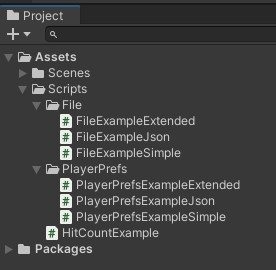
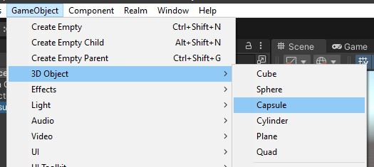
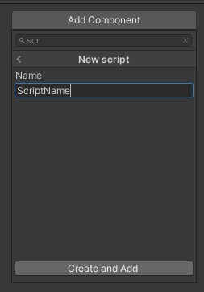
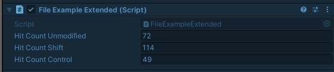
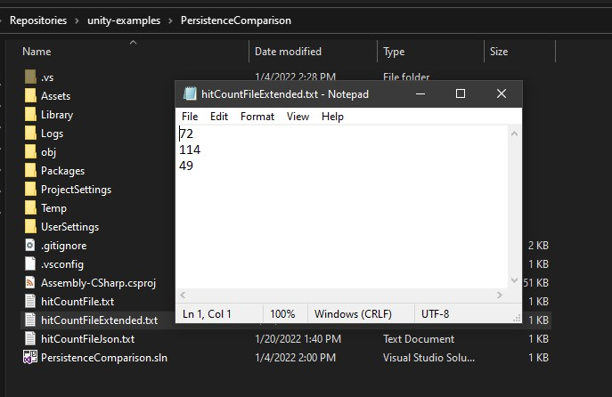
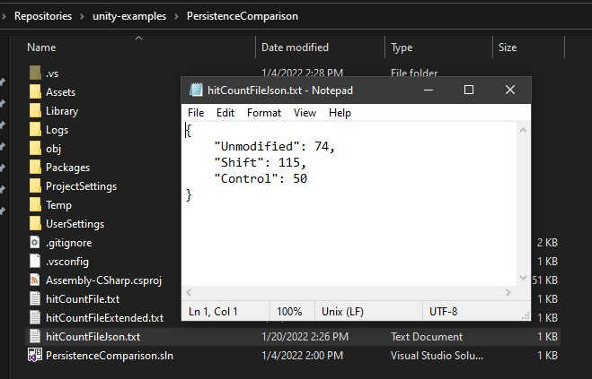

# Saving Data in Unity3D using Files
<b>(Part 2 of the Persistence Comparison Series)</b>

## Introduction

Persisting data is an important part of most games. Unity offers only a limited set of solutions which means we have to look around for other options as well.

In Part 1 of this series we explored Unity's own solution: `PlayerPrefs`. This time we look into one of the ways we can use the underlying .NET framework by saving files. Here is an overview of the complete series:

- Part 1: [PlayerPrefs](https://github.com/realm/unity-examples/blob/persistence-comparison/tutorials/persistance-comparison-series/PlayerPrefs/player_prefs.md)
- Part 2: Files *(this tutorial)*
- Part 3: BinaryReader and BinaryWriter *(coming soon)*
- Part 4: SQL
- Part 5: Realm Unity SDK
- Part 6: Comparison of all those options

Like part 1 this tutorial can also be found in the https://github.com/realm/unity-examples repository on the [persistence-comparison](https://github.com/realm/unity-examples/tree/persistence-comparison) branch.



Each part is sorted into a folder, the three scripts we will be looking at are in the `File` sub folder. But first let's look at the example game itself and what we have to prepare in Unity before we can jump into the actual coding.

## Example game

*Note that if you have worked through any of the other tutorials in this series you can skip this section since we are using the same example for all parts of the series so that it is easier to see the differences between the approaches.*

The goal of this tutorial series is to show you a quick and easy way to make some first steps in the various ways to persist data in your game.

Therefore the example we will be using will be as simply as possible in the editor itself so that we can fully focus on the actual code we need to write.


A simple capsule in the scene will be used so that we can interact with a game object. We then register clicks on the capsule and persist the hit count.



When you open up a clean 3D template, all you need to do is choosing `GameObject` -> `3D Object` -> `Capsule`.

You can then add scripts to the capsule by activating it in the hierarchy and using `Add Component` in the inspector.




The scripts we will add to this capsule showcasing the different methods will all have the same basic structure that can be found in `HitCountExample.cs`.

```cs
using UnityEngine;

/// <summary>
/// This script shows the basic structure of all other scripts.
/// </summary>
public class HitCountExample : MonoBehaviour
{
    // Keep count of the clicks.
    [SerializeField] private int hitCount; // 1

    private void Start() // 2
    {
        // Read the persisted data and set the initial hit count.
        hitCount = 0; // 3
    }

    private void OnMouseDown() // 4
    {
        // Increment the hit count on each click and save the data.
        hitCount++; // 5
    }
}
```

The first thing we need to add is a counter for the clicks on the capsule (1). Add a `[SerilizeField]` here so that you can observe it while clicking on the capsule in the Unity editor.

Whenever the game starts (2) we want to read the current hit count from the persistence and initialize `hitCount` accordingly (3). This is done in the `Start()` method that is called whenever a scene is loaded for each game object this script is attached to.

The second part to this is saving changes which we want to do whenever we register a mouse click. The Unity message for this is `OnMouseDown()` (4). This method gets called every time the `GameObject` that this script is attached to is clicked (with a left mouse click). In this case we increment the `hitCount` (5) which will eventually be saved by the various options shown in this tutorials series.

## File

(see `FileExampleSimple.cs` in the repository for the finished version)

One of the ways the .NET framework offers us to save data is using the [`File` class](https://docs.microsoft.com/en-us/dotnet/api/system.io.file?view=net-5.0):

> Provides static methods for the creation, copying, deletion, moving, and opening of a single file, and aids in the creation of FileStream objects.

Besides that the `File` class is also used to manipulate the file itself, reading and writing data. On top of that if offers ways to read meta data of a file like time of creation.

When working with a file you can also make use of several options to change `FileMode` or `FileAccess.`

The `FileStream` mentioned in the documentation is another approach to work with those files, providing additional options. In this tutorial we will just use the plain `File` class.

Let's have a look at what we have to change in the example presented in the previous section to save the data using `File`:

```cs
using System;
using System.IO;
using UnityEngine;

public class FileExampleSimple : MonoBehaviour
{
    // Resources:
    // https://docs.microsoft.com/en-us/dotnet/api/system.io.file?view=net-5.0

    [SerializeField] private int hitCount = 0;

    private const string HitCountFile = "hitCountFile.txt";

    private void Start()
    {
        if (File.Exists(HitCountFile))
        {
            var fileContent = File.ReadAllText(HitCountFile);
            hitCount = Int32.Parse(fileContent);
        }
    }

    private void OnMouseDown()
    {
        hitCount++;

        // The easiest way when working with Files is to use them directly.
        // This writes all input at once and overwrites a file if executed again.
        // The File is opened and closed right away.
        File.WriteAllText(HitCountFile, hitCount.ToString());
    }

}
```

First we define a name for the file that will hold the data (1). If no additional path is provided the file will just be saved in the project folder when running the game in the Unity editor or the game folder when running a build. This is fine for the example.

Whenever we click on the capsule (2) and increment the hit count (3) we need to save that change. Using `File.WriteAllText()` (4) the file will be opened, data will be saved and it will be closed right away. Besides the file name this function expects the contents as a string. Therefore we have to transform the `hitCount` by calling `ToString()` before passing it on.

The next time we start the game (5) we want to load the previously saved data. First we check if the file already exists (6). If it does not exist we did never save before and can just keep the default value for `hitCount`. If the file exists we use `ReadAllText()` to get that data (7). Since this is a string again, we need to convert here as well using `Int32.Parse()` (8). Note that this means we have to be sure about what we read. If the structure of the file changes or the player edits it this might lead to problems during the parsing of the file.

Let's look into extending this simple example in the next section.

## Extended example

(see `FileExampleExtended.cs` in the repository for the finished version)

The previous section has shown the most simple example, using just one variable that needs to be saved. What if we want to save more than that?

Depending on what needs to saved there are several different approaches. You could use multiple files or you can write multiple lines inside the same file. The latter shall be shown in this section by extending the game to recognize modifier keys. We want to detect normal clicks, Shift+Click and Control+Click.

First, update the hit counts so that we can save three of them:

```cs
[SerializeField] private int hitCountUnmodified = 0;
[SerializeField] private int hitCountShift = 0;
[SerializeField] private int hitCountControl = 0;
```

We also want to use a different file name so we can look at both version next to each other:

```cs
private const string HitCountFileUnmodified = "hitCountFileExtended.txt";
```

The last field we need to define is the key that is pressed:

```cs
private KeyCode modifier = default;
```

The first thing we need to do is check if a key was pressed and which key it was. Unity offers an easy way to achieve this using the [`Input`](https://docs.unity3d.com/ScriptReference/Input.html) class's `GetKey` function. It checks if the given key was pressed or not. You can pass in the string for the key or to be a bit more safe, just use the `KeyCode` enum. We cannot use this in the `OnMouseClick()` when detecting the mouse click though:

> Note: Input flags are not reset until Update. You should make all the Input calls in the Update Loop.

Add a new method called `Update()` (1) which is called in every frame. Here we need to check if the `Shift` or `Control` key was pressed (2) and if so, save the corresponding key in `modifier` (3). In case none of those keys was pressed (4) we consider it unmodified and reset `modifier` to its `default` (5).

```cs
private void Update() // 1
{
    // Check if a key was pressed.
    if (Input.GetKey(KeyCode.LeftShift)) // 2
    {
        // Set the LeftShift key.
        modifier = KeyCode.LeftShift; // 3
    }
    else if (Input.GetKey(KeyCode.LeftControl)) // 2
    {
        // Set the LeftControl key.
        modifier = KeyCode.LeftControl; // 3
    }
    else // 4
    {
        // In any other case reset to default and consider it unmodified.
        modifier = default; // 5
    }
}
```

Now to saving the data when a click happens:

```cs
private void OnMouseDown() // 6
{
    // Check if a key was pressed.
    switch (modifier)
    {
        case KeyCode.LeftShift: // 7
            // Increment the Shift hit count.
            hitCountShift++; // 8
            break;
        case KeyCode.LeftCommand: // 7
            // Increment the Control hit count.
            hitCountControl++; // 8
            break;
        default: // 9
            // If neither Shift nor Control was held, we increment the unmodified hit count.
            hitCountUnmodified++; // 10
            break;
    }

    // 11
    // Create a string array with the three hit counts.
    string[] stringArray = {
        hitCountUnmodified.ToString(),
        hitCountShift.ToString(),
        hitCountControl.ToString()
    };

    // 12
    // Save the entries, line by line.
    File.WriteAllLines(HitCountFileUnmodified, stringArray);
}
```

Whenever a mouse click is detected on the capsule (6) we can then perform a similar check to what happened in `Update()` only that we use `modifier` instead of `Input.GetKey()` here.

Check if `modifier` was set to `KeyCode.LeftShift` or `KeyCode.LeftControl` (7) and if so, increment the corresponding hit count (8). If no modifier was used (9), increment the `hitCountUnmodified`.

As seen in the last section we need to create a string that can be saved in the file. There is a second function on `File` that accepts a a string array and then saves each entry in one line: `WriteAllLines()`.

Knowing this we create an array containing the three hit counts (11) and pass this one on to `File.WriteAllLines()`.

Start the game, click the capsule using Shift and Control. You should see the three counters in the Inspector.



After stopping the game and therefore saving the data a new file `hitCountFileExtended.txt` should exist in your project folder. Have look at it, it should look something like this:



Last but not least, let's look at how to load the file again when starting the game:

```cs
private void Start()
{
    // 12
    // Check if the file exists. If not, we never saved before.
    if (File.Exists(HitCountFileUnmodified))
    {
        // 13
        // Read all lines.
        string[] textFileWriteAllLines = File.ReadAllLines(HitCountFileUnmodified);

        // 14
        // For this extended example we would expect to find three lines, one per counter.
        if (textFileWriteAllLines.Length == 3)
        {
            // 15
            // Set the counters correspdoning to the entries in the array.
            hitCountUnmodified = Int32.Parse(textFileWriteAllLines[0]);
            hitCountShift = Int32.Parse(textFileWriteAllLines[1]);
            hitCountControl = Int32.Parse(textFileWriteAllLines[2]);
        }
    }
}
```

First, we check if the file even exists (12). If we ever saved data before, this should be the case. If it exists, we read the data. Similar to writing with `WriteAllLines()` we use `ReadAllLines` (13) to create a string array where each entry represents one line in the file.

We do expect there to be three lines so we should expect the string array to have three entries (14).
Using this knowledge we can then assign the three entries from the array to the corresponding hit counts (15).

As long as all the data saved to those lines belongs together, the file can be one option. If you have several different properties you might create multiple files. Alternatively you can save all the data into the same file using a bit of structure. Note though that the numbers will not be associated with the properties. If the structure of the object changes, we would need to migrate the file as well and take this into account the next time we open and read the file.

Another possible approach to structuring your data will be shown in the next section using JSON.

## More complex data

(see `FileExampleJson.cs` in the repository for the finished version)

JSON is a very common approach when saving structured data. It's easy to use and there are framework for almost any language. The .NET framework provides a [`JsonSerializer`](https://docs.microsoft.com/en-us/dotnet/api/system.text.json.jsonserializer?view=net-6.0). Unity has it's own version of it: [`JsonUtility`](https://docs.unity3d.com/ScriptReference/JsonUtility.html)

As you can see in the documentation the functionality boils down to these three methods:

- *FromJson*: Create an object from its JSON representation.
- *FromJsonOverwrite*: Overwrite data in an object by reading from its JSON representation.
- *ToJson*: Generate a JSON representation of the public fields of an object.

The `JsonUtility` transforms JSON into objects and back. Therefore our first change to the previous section is to define such an object with public fields:

```cs
private class HitCount
{
    public int Unmodified;
    public int Shift;
    public int Control;
}
```

The class itself can be `private` and just be added inside the `FileExampleJson` class but its fields need to be public.

As before we use a different file to save this data. Update the filename to:

```cs
private const string HitCountFileJson = "hitCountFileJson.txt";
```

When saving the data we will use the same `Update()` method as before to detect which key was pressed.

The first part of `OnMouseDown()` (1) can stay the same as well since this part only increments the hit count in depending on the modifier used.

```cs
private void OnMouseDown()
{
    // 1
    // Check if a key was pressed.
    switch (modifier)
    {
        case KeyCode.LeftShift:
            // Increment the Shift hit count.
            hitCountShift++;
            break;
        case KeyCode.LeftCommand:
            // Increment the Control hit count.
            hitCountControl++;
            break;
        default:
            // If neither Shift nor Control was held, we increment the unmodified hit count.
            hitCountUnmodified++;
            break;
    }

    // 2
    // Create a new HitCount object to hold this data.
    var updatedCount = new HitCount
    {
        Unmodified = hitCountUnmodified,
        Shift = hitCountShift,
        Control = hitCountControl,
    };

    // 3
    // Create a JSON using the HitCount object.
    var jsonString = JsonUtility.ToJson(updatedCount, true);

    // 4
    // Save the json to the file.
    File.WriteAllText(HitCountFileJson, jsonString);
}
```

However, we need to update the second part. Instead of a string array we create a new `HitCount` object and set the three public fields to the values of the hit counters (2).

Using `JsonUtility.ToJson()` we can transform this object to a string (3). If you pass in `true` for the second, optional parameter `prettyPrint` the string will be formatted in a nicely readable way.

Finally, as in `FileExampleSimple.cs` we just use `WriteAllText()` since we're only saving one string, not an array (4).

Then, when the game starts, we need to read the data back into the hit count:

```cs
private void Start()
{
    // Check if the file exists to avoid errors when opening a non-existing file.
    if (File.Exists(HitCountFileJson)) // 5
    {
        // 6
        var jsonString = File.ReadAllText(HitCountFileJson);
        var hitCount = JsonUtility.FromJson<HitCount>(jsonString);

        // 7
        if (hitCount != null)
        {
            // 8
            hitCountUnmodified = hitCount.Unmodified;
            hitCountShift = hitCount.Shift;
            hitCountControl = hitCount.Control;
        }
    }
}
```

We check if the file exists first (5). In case it does, we saved data before and can proceed reading it.

Using `ReadAllText` we read the string from the file and transform it via `JsonUtility.FromJson<>()` into an object of type `HitCount` (6).

If this happened successfully (7) we can then assign the three properties to their corresponding hit count (8).

When you run the game you will see the that in the editor it looks identical to the previous section since we are using the same three counters. If you open the file `hitCountFileJson.txt` you should then see the three counters in a nicely formatted JSON.



## Conclusion

In this tutorial we learned how to utilize `File` to save data. `JsonUtility` helps structure this data. They are simple and easy to use, not much code is required.

What are the down sides though?

First of, we open, write to and save the file every single time the capsule it clicked. While not a problem in this case and certainly applicable for some games this will not perform very well when many save operations are made.

Also, the data is saved in plain text and can easily be edited by the player.

The more complex your data is, the more complex it will be to actually maintain this approach. What if the structure of the `HitCount` object changes? You have to change account for that when loading an older version of the JSON. Migrations are necessary.

In the following tutorials we will (among others) have a look at how databases can make this job a lot easier and take care of the problems we face here.

Please provide feedback and ask any questions in the [Realm Community Forum](https://www.mongodb.com/community/forums/tags/c/realm/realm-sdks/58/unity).