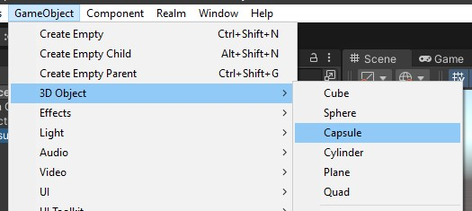

# Saving Data in Unity3D using PlayerPrefs
<b>(Part 1 of the Persistence Comparison Series)</b>

## Introduction

Persisting data is an important part of most games. Unity offers only a limited set of solutions which means we have to look around for other options as well.

In this tutorial series we will explore the options given to us by Unity and third party libraries. Each part will take a deeper look into one of them with the final part being a comparison:

- Part 1: PlayerPrefs *(this tutorial)*
- Part 2: Files *(coming soon)*
- Part 3: BinaryReader and BinaryWriter
- Part 4: SQL
- Part 5: Realm Unity SDK
- Part 6: Comparison of all those options

To make it easier to follow along we have prepared an example repository for you. All those examples can be found within the same Unity project since they all use the same example game so you can see the differences between those persistence approaches better.

The repository can be found at https://github.com/realm/unity-examples with this tutorial being on the [persistence-comparison](https://github.com/realm/unity-examples/tree/persistence-comparison) branch next to other tutorials we have prepared for you.

## Example game

*Note that if you have worked through any of the other tutorials in this series you can skip this section since we are using the same example for all parts of the series so that it is easier to see the differences between the approaches.*

The goal of this tutorial series is to show you a quick and easy way to make some first steps in the various ways to persist data in your game.

Therefore the example we will be using will be as simply as possible in the editor itself so that we can fully focus on the actual code we need to write.


A simple capsule in the scene will be used so that we can interact with a game object. We then register clicks on the capsule and persist the hit count.



When you open up a clean 3D template, all you need to do is choosing `GameObject` -> `3D Object` -> `Capsule`.

You can then add scripts to the capsule by activating it in the hierarchy and using `Add Component` in the inspector.


The scripts we will add to this capsule showcasing the different methods will all have the same basic structure that can be found in `HitCountExample.cs`.

```cs
using UnityEngine;

/// <summary>
/// This script shows the basic structure of all other scripts.
/// </summary>
public class HitCountExample : MonoBehaviour
{
    // Keep count of the clicks.
    [SerializeField] private int hitCount; // 1

    private void Start() // 2
    {
        // Read the persisted data and set the initial hit count.
        hitCount = 0; // 3
    }

    private void OnMouseDown() // 4
    {
        // Increment the hit count on each click and save the data.
        hitCount++; // 5
    }
}

```

The first thing we need to add is a counter for the clicks on the capsule (1). Add a `[SerilizeField]` here so that you can observe it while clicking on the capsule in the Unity editor.

Whenever the game starts (2) we want to read the current hit count from the persistence and initialize `hitCount` accordingly (3). This is done in the `Start()` method that is called whenever a scene is loaded for each game object this script is attached to.

The second part to this is saving changes, which we want to do whenever we register a mouse click. The Unity message for this is `OnMouseDown()` (4). This method gets called every time the `GameObject` that this script is attached to is clicked (with a left mouse click). In this case we increment the `hitCount` (5) which will eventually be saved by the various options shown in this tutorials series.

## PlayerPrefs

(see `PlayerPrefsExampleSimple.cs` in the repository for the finished version)

The easiest and probably most straight forward way to save data in Unity is using the built in [`PlayerPrefs`](https://docs.unity3d.com/ScriptReference/PlayerPrefs.html). The downside however is the limited usability since only three data types are supported:

- string
- float
- integer

Another important fact about them is that they save data in plain text which means a player can easily change their content. `PlayerPrefs` should therefore only be used for things like graphic settings, user names and other data that could be changed in game anyway and therefore does not need to be safe.

Depending on the operating system the game is running on, the `PlayerPrefs` get saved in different locations. They are all [listed in the documentation](https://docs.unity3d.com/ScriptReference/PlayerPrefs.html), Windows for example uses the registry to save the data under `HKCU\Software\ExampleCompanyName\ExampleProductName`

The usage of `PlayerPrefs` is basically the same as a dictionary. They get accessed as `key`/`value` pairs where the `key` is of type `string`. Each supported data type has its own function:

- SetString(key, value)
- GetString(key)
- SetFloat(key, value)
- GetFloat(key)
- SetInt(key, value)
- GetInt(key)

```cs
using UnityEngine;

public class PlayerPrefsExampleSimple : MonoBehaviour
{
    // Resources:
    // https://docs.unity3d.com/ScriptReference/PlayerPrefs.html

    [SerializeField] private int hitCount = 0;

    private readonly string hitCountKey = "HitCountKey"; // 1

    private void Start()
    {
        // Check if the key exists. If not, we never saved the hit count before.
        if (PlayerPrefs.HasKey(hitCountKey)) // 2
        {
            // Read the hit count from the PlayerPrefs.
            hitCount = PlayerPrefs.GetInt(hitCountKey); // 3
        }
    }

    private void OnMouseDown()
    {
        hitCount++;

        // Set and save the hit count before ending the game.
        PlayerPrefs.SetInt(hitCountKey, hitCount); // 4
        PlayerPrefs.Save(); // 5
    }

}

```

For the `PlayerPrefs` example we create a script named `PlayerPrefsExampleSimple` based on the `HitCountExample` shown earlier.

In addition to the basic structure we also need to define a key (1) that will be used to save the `hitCount` in the `PlayerPrefs`, let's call it `"HitCountKey"`.

When the game starts we first want to check if there was already a hit count saved. The `PlayerPrefs` have a built-in function `HasKey(hitCountKey)` (2) that let's us achieve exactly this. If the key exists we read it using `GetInt(hitCountKey)` (3) and save it in the counter.

The second part is saving data whenever it changes. On each click after we incremented the `hitCount` we have to call `SetInt(key, value)` on `PlayerPrefs` (4) to set the new data. Note that this does not save the data to disk. This only happens during `OnApplicationQuit()` implicitly. We can explicitly write the data to disk at any time to avoid loosing data in case the game crashes and `OnApplicationQuit()` never gets called.
To write the data to disk we call `Save()` (5).

## Extended example

(see `PlayerPrefsExampleExtended.cs` in the repository for the finished version)

In the second part of this tutorial we will extend this very simple version to look at ways to save more complex data within `PlayerPrefs`.

Instead of just detecting a mouse click the extended script will detect `Shift+Click` and `Ctrl+Click` as well.

Again, to visualize this in the editor we will add some more `[SerializeFields]` (1). Substitute the current one (`hitCount`) with the following:

```cs
// 1
[SerializeField] private int hitCountUnmodified = 0;
[SerializeField] private int hitCountShift = 0;
[SerializeField] private int hitCountControl = 0;
```

Each type of click will be shown in its own `Inspector` element.

The same has to be done for the `PlayerPrefs` keys. Remove the `HitCountKey` and add three new elements (2).

```cs
// 2
private readonly string HitCountKeyUnmodified = "HitCountKeyUnmodified";
private readonly string HitCountKeyShift = "HitCountKeyShift";
private readonly string HitCountKeyControl = "HitCountKeyControl";
```

There are many different ways to save more complex data. Here we will be using three different entries in `PlayerPrefs` as a first step. Later we will also look at how we can save structured data that belongs together in a different way.

One more field we need to save is the `KeyCode` for the key that was pressed:

```cs
private KeyCode modifier = default;
```

When starting the scene, loading the data looks similar to the previous example, just extended by two more calls:

```cs
private void Start()
{
    // Check if the key exists. If not, we never saved the hit count before.
    if (PlayerPrefs.HasKey(HitCountKeyUnmodified)) // 4
    {
        // Read the hit count from the PlayerPrefs.
        hitCountUnmodified = PlayerPrefs.GetInt(HitCountKeyUnmodified); // 5
    }
    if (PlayerPrefs.HasKey(HitCountKeyShift)) // 4
    {
        // Read the hit count from the PlayerPrefs.
        hitCountShift = PlayerPrefs.GetInt(HitCountKeyShift); // 5
    }
    if (PlayerPrefs.HasKey(HitCountKeyControl)) // 4
    {
        // Read the hit count from the PlayerPrefs.
        hitCountControl = PlayerPrefs.GetInt(HitCountKeyControl); // 5
    }
}
```

As before, we first check if the key exists in the `PlayerPrefs` (4) and if so, we set the corresponding counter (5) to its value. This is fine for a simple example but here you can already see that saving more complex data will bring `PlayerPrefs` very soon to its limits if you do not want to write a lot of boilerplate code.

Unity offers a detection for keyboard clicks and other input like a controller or the mouse via a class called [`Input`](https://docs.unity3d.com/ScriptReference/Input.html). Using `GetKey` we can check if a specific key was held down the moment we register a mouse click.

The documentation tells us about one important fact though:

> Note: Input flags are not reset until Update. You should make all the Input calls in the Update Loop.

Therefore we also need to implement the [`Update()`](https://docs.unity3d.com/ScriptReference/MonoBehaviour.Update.html) function (6) where we check for the key and save it in the previously defined `modifier`.

The keys can be addressed via their name as string but the type safe way to do this is to use the class `KeyCode` which defines every key necessary. For our case this would be `KeyCode.LeftShift` and `KeyCode.LeftControl`.

Those checks use `Input.GetKey()` (7) and if one of the two was found, it will be saved as the `modifier` (8). If neither of them was pressed (9) we just reset `modifier` to the `default` (10) which we will use as a marker for an unmodified mouse click.

```cs
private void Update() // 6
{
    // Check if a key was pressed.
    if (Input.GetKey(KeyCode.LeftShift)) // 7
    {
        // Set the LeftShift key.
        modifier = KeyCode.LeftShift; // 8
    }
    else if (Input.GetKey(KeyCode.LeftControl)) // 7
    {
        // Set the LeftControl key.
        modifier = KeyCode.LeftControl; // 8
    }
    else // 9
    {
        // In any other case reset to default and consider it unmodified.
        modifier = default; // 10
    }
}
```

The same triplet can then also be found in the click detection:

```cs
private void OnMouseDown()
{
    // Check if a key was pressed.
    switch (modifier)
    {
        case KeyCode.LeftShift: // 11
            // Increment the hit count and set it to PlayerPrefs.
            hitCountShift++; // 12
            PlayerPrefs.SetInt(HitCountKeyShift, hitCountShift); // 15
            break;
        case KeyCode.LeftCommand: // 11
            // Increment the hit count and set it to PlayerPrefs.
            hitCountControl++; // 
            PlayerPrefs.SetInt(HitCountKeyControl, hitCountControl); // 15
            break;
        default: // 13
            // Increment the hit count and set it to PlayerPrefs.
            hitCountUnmodified++; // 14
            PlayerPrefs.SetInt(HitCountKeyUnmodified, hitCountUnmodified); // 15
            break;
    }

    // Persist the data to disk.
    PlayerPrefs.Save(); // 16
}
```

First we check if one of those two was held down while the click happened (11) and if so, increment the corresponding hit counter (12). If not (13), the `unmodfied` counter has to be incremented (14).

Finally, we need to set each of those three counters individually (15) via `PlayerPrefs.SetInt()` using the three keys we defined earlier.

Like in the previous example, we also call `Save()` (16) at the end to make sure, data does not get lost if the game does not end normally.

When switching back to the Unity editor, the script on the capsule should now look like this:


## More complex data

(see `PlayerPrefsExampleJson.cs` in the repository for the finished version)

In the previous two sections we have seen how to handle two simple examples of persisting data in `PlayerPrefs`. What if they get more complex than that? What if you want to structure and group data together?

One possible approach would be to use the fact that `PlayerPrefs` can hold a `string` and save a `JSON` in there.

First we need to figure out how to actually transform our data into JSON. The .NET framework as well as the `UnityEngine` framework offer a JSON serializer and deserializer to do this job for us. Both behave very similar but we will use Unity's own [`JsonUtility`](https://docs.unity3d.com/ScriptReference/JsonUtility.html) which [performs better in Unity than other similar JSON solutions](https://docs.unity3d.com/Manual/JSONSerialization.html).

To transform data to JSON we first need to create a container object. This has [some restrictions](https://docs.unity3d.com/ScriptReference/JsonUtility.ToJson.html):

> Internally, this method uses the Unity serializer; therefore the object you pass in must be supported by the serializer: it must be a MonoBehaviour, ScriptableObject, or plain class/struct with the Serializable attribute applied. The types of fields that you want to be included must be supported by the serializer; unsupported fields will be ignored, as will private fields, static fields, and fields with the NonSerialized attribute applied.

In our case, since we are only saving simple data types (int) for now that's fine. We can define a new class (1) and call it `HitCount`:

```cs
// 1
private class HitCount
{
    public int Unmodified;
    public int Shift;
    public int Control;
}
```

We will keep the Unity editor outlets the same (2):

```cs
// 2
[SerializeField] private int hitCountUnmodified = 0;
[SerializeField] private int hitCountShift = 0;
[SerializeField] private int hitCountControl = 0;
```

All those will eventually be saved into the same `PlayerPrefs` field which means we only need one key (3):

```cs
// 3
private readonly string hitCountKey = "HitCountKeyJson";
```

As before, the `modifier` will indicate which modifier was used:

```cs
// 4
private KeyCode modifier = default;
```

In `Start()` we then need to read the JSON. As before, we check if the `PlayerPrefs` key exists (5) and then read the data, this time using `GetString()` (as opposed to `GetInt()` before).

Transforming this JSON into the actual object is then done using `JsonUtility.FromJson()` (6) which takes the string as an argument. It's a generic function and we need to provide the information about which object this JSON is supposed to be representing, in this case `HitCount`.

If the JSON could be read and transformed successfully we can set the hit count fields (7) to their three values.

```cs
private void Start()
{
    // 5
    // Check if the key exists. If not, we never saved to it.
    if (PlayerPrefs.HasKey(HitCountKey))
    {
        // 6
        string jsonString = PlayerPrefs.GetString(HitCountKey);
        HitCount hitCount = JsonUtility.FromJson<HitCount>(jsonString);

        // 7
        if (hitCount != null)
        {
            hitCountUnmodified = hitCount.Unmodified;
            hitCountShift = hitCount.Shift;
            hitCountControl = hitCount.Control;
        }
    }
}
```

The detection for the key that was pressed is identical to the extended example since it does not involve loading or saving any data but is just a check for the key during `Update()`:

```cs
private void Update() // 8
{
    // Check if a key was pressed.
    if (Input.GetKey(KeyCode.LeftShift)) // 9
    {
        // Set the LeftShift key.
        modifier = KeyCode.LeftShift; // 10
    }
    else if (Input.GetKey(KeyCode.LeftControl)) // 9
    {
        // Set the LeftControl key.
        modifier = KeyCode.LeftControl; // 10
    }
    else // 11
    {
        // In any other case reset to default and consider it unmodified.
        modifier = default; // 12
    }
}
```

In a very similar fashion `OnMouseDown()` needs to save the data whenever it's changed.

```cs
private void OnMouseDown()
{
    // Check if a key was pressed.
    switch (modifier)
    {
        case KeyCode.LeftShift: // 13
            // Increment the hit count and set it to PlayerPrefs.
            hitCountShift++; // 14
            break;
        case KeyCode.LeftCommand: // 13
            // Increment the hit count and set it to PlayerPrefs.
            hitCountControl++; // 14
            break;
        default: // 15
            // Increment the hit count and set it to PlayerPrefs.
            hitCountUnmodified++; // 16
            break;
    }

    // 17
    HitCount hitCount = new();
    hitCount.Unmodified = hitCountUnmodified;
    hitCount.Shift = hitCountShift;
    hitCount.Control = hitCountControl;

    // 18
    string jsonString = JsonUtility.ToJson(hitCount);
    PlayerPrefs.SetString(HitCountKey, jsonString);
    PlayerPrefs.Save();
}
```

Compared to before you see that checking the key and increasing the counter (13 - 16) is basically unchanged except for the save part that is now a bit different.

First, we need to create a new `HitCount` object (17) and assign the three counts. Using `JsonUtility.ToJson()` we can then (18) create a JSON string from this object and set it using the `PlayerPrefs`.

Remember to also call `Save()` here to make sure data cannot get lost in case the game crashes without being able to call `OnApplicationQuit()`.

Run the game and after you clicked the capsule a couple of time with or without Shift and Control, have a look at the result. The following screenshot shows the Windows registry which is where the `PlayerPrefs` get saved.

The location is `HKEY_CURRENT_USER\SOFTWARE\Unity\UnityEditor\MongoDB Inc.\UnityPersistenceExample` and as you can see our JSON is right there, saved in plain text. Which is also one of the big down sides to keep in mind when using `PlayerPrefs`: data is not save and can easily be edited.


## Conclusion

In this tutorial we have seen how to save and load data using `PlayerPrefs`. They are very simple and easy to use and a great choice for some simple data points. If it gets a bit more complex, you can save data using multiple fields or wrapping them into an object which can then be serialized using `JSON`.

What happens if you want to persist multiple objects of the same class? Or multiple classes? Maybe with relationships between them? And what if the structure of those objects changes?

As you see, `PlayerPrefs` get to their limits really fast. As easy as they are to use as limited they are.

In future tutorials we will explore other options to persist data in Unity and how they can solve some or all of the above questions.

Please provide feedback and ask any questions in the [Realm Community Forum](https://www.mongodb.com/community/forums/tags/c/realm/realm-sdks/58/unity).