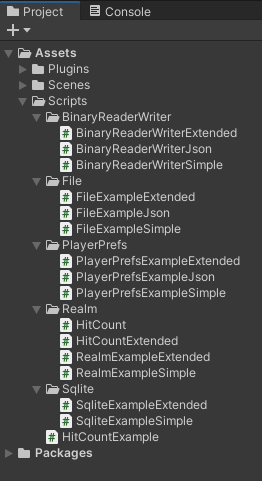
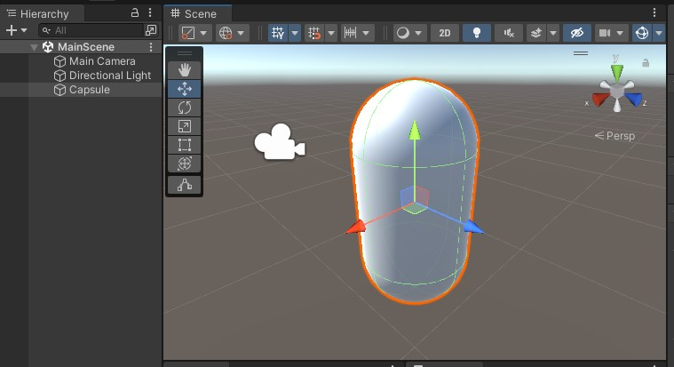
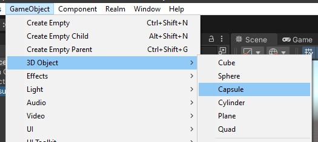
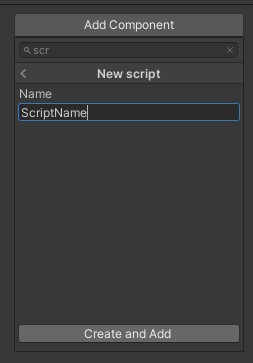
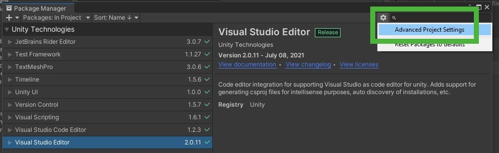
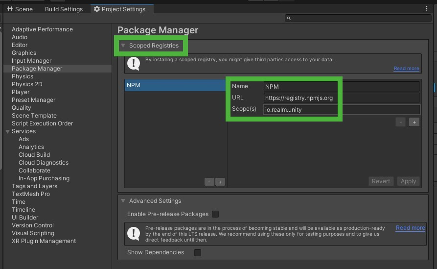

# Saving Data in Unity3D Using Realm
<b>(Part 5 of the Persistence Comparison Series)</b>

## Introduction

We started this tutorial series by looking at Unity and .NET native ways to persist data, like `PlayerPrefs`, `File` and the `BinaryReader` / `BinaryWriter`. In the previous part we then continued on to external libraries and with that, databases. We looked at ``SQLite` as one example.

This time we will look at another database. One that makes it very easy and intuitive to work with data: the []Realm Unity SDK](https://www.mongodb.com/docs/realm/sdk/dotnet/unity/).

First, here is an overview over the complete series:

- Part 1: [PlayerPrefs](https://github.com/realm/unity-examples/tree/persistence-comparison/tutorials/persistance-comparison-series/PlayerPrefs)
- Part 2: [Files](https://github.com/realm/unity-examples/blob/persistence-comparison/tutorials/persistance-comparison-series/File/file.md)
- Part 3: [BinaryReader and BinaryWriter](https://github.com/realm/unity-examples/blob/persistence-comparison/tutorials/persistance-comparison-series/BinaryWriterReader/binary_reader_writer.md)
- Part 4: [SQLite](https://github.com/realm/unity-examples/blob/persistence-comparison/tutorials/persistance-comparison-series/Sqlite/sqlite.md)
- Part 5: Realm Unity SDK *(this tutorial)*

Similar to the previous parts, this tutorial can also be found in our [Unity examples repository](https://github.com/realm/unity-examples) on the [persistence-comparison](https://github.com/realm/unity-examples/tree/persistence-comparison) branch.



Each part is sorted into a folder. The four scripts we will be looking at in this tutorial are in the `Realm` sub folder. But first, let's look at the example game itself and what we have to prepare in Unity before we can jump into the actual coding.

## Example game

*Note that if you have worked through any of the other tutorials in this series, you can skip this section since we're using the same example for all parts of the series, so that it's easier to see the differences between the approaches.*

The goal of this tutorial series is to show you a quick and easy way to make some first steps in the various ways to persist data in your game.

Therefore, the example we'll be using will be as simple as possible in the editor itself so that we can fully focus on the actual code we need to write.



A simple capsule in the scene will be used so that we can interact with a game object. We then register clicks on the capsule and persist the hit count.



When you open up a clean 3D template, all you need to do is choose `GameObject` -> `3D Object` -> `Capsule`.

You can then add scripts to the capsule by activating it in the hierarchy and using `Add Component` in the inspector.




The scripts we will add to this capsule showcasing the different methods will all have the same basic structure that can be found in `HitCountExample.cs`.

```cs
using UnityEngine;

/// <summary>
/// This script shows the basic structure of all other scripts.
/// </summary>
public class HitCountExample : MonoBehaviour
{
    // Keep count of the clicks.
    [SerializeField] private int hitCount; // 1

    private void Start() // 2
    {
        // Read the persisted data and set the initial hit count.
        hitCount = 0; // 3
    }

    private void OnMouseDown() // 4
    {
        // Increment the hit count on each click and save the data.
        hitCount++; // 5
    }
}
```

The first thing we need to add is a counter for the clicks on the capsule (1). Add a `[SerilizeField]` here so that you can observe it while clicking on the capsule in the Unity editor.

Whenever the game starts (2), we want to read the current hit count from the persistence and initialize `hitCount` accordingly (3). This is done in the `Start()` method that is called whenever a scene is loaded for each game object this script is attached to.

The second part to this is saving changes, which we want to do whenever we register a mouse click. The Unity message for this is `OnMouseDown()` (4). This method gets called every time the `GameObject` that this script is attached to is clicked (with a left mouse click). In this case, we increment the `hitCount` (5) which will eventually be saved by the various options shown in this tutorials series.

## Realm

(See `HitCount.cs` and ``RealmExampleSimple.cs` in the repository for the finished version.)

Now that you have seen the example and the increasing hit counter, the next step will be to actually persist it so that it's available the next time we start the game.

As described in the [documentation](https://www.mongodb.com/docs/realm/sdk/dotnet/unity/), you can install Realm in two different ways:

- Install with NPM
- Manually Install a Tarball

Let's choose option #1 for this tutorial. The first thing we need to do is to import the Realm framework into Unity using the project settings.

Go to `Windows` → `Package Manager` → cogwheel in the top right corner → `Advanced Project Settings`:



Within the `Scoped Registries` you can add the `Name`, `URL` and `Scope` as follows:



This adds `NPM` as a source for libraries. The final step is to tell the project which dependencies to actually integrate into the project. This is done in the `manifest.json` file which is located in the `Packages` folder of your project.

Here you need to add the following line to the `dependencies`:

```json
"io.realm.unity": "<version-number>"
```

Replace `<version-number>` with the most recent Realm version found in https://github.com/realm/realm-dotnet/releases and you're all set.

The final `manifest.json` should look something like this:

```json
{
 "dependencies": {
   ...
   "io.realm.unity": "10.13.0"
 },
 "scopedRegistries": [
   {
     "name": "NPM",
     "url": "https://registry.npmjs.org/",
     "scopes": [
       "io.realm.unity"
     ]
   }
 ]
}
```

When you switch back to Unity it will reload the dependencies. If you then open the `Package Manager` again, you should see `Realm` as a new entry in the list on the left:


We can now start using Realm in our Unity project.

Similar to other databases, we need to start by telling the Realm SDK how our database structure is supposed to look like. We have seen this in the previous tutorial with SQL, where we had to defined tables and column for each class we want to save.

With Realm, this is a lot easier, we can just define in our code by adding some additional information to let know Realm how to read that code.

Look at the following definition of `HitCount`. You will notice that the super class for this one is `RealmObject` (1). When starting your game, Realm will automatically look for all sub classes of `RealmObject` and know that it needs to be prepared to persist this kind of data. This is all you need to do to get started when defining a new class. One additional thing we will do here though is to define which of the properties is the primary key, we will see later why. Do this by adding the attribute `PrimaryKey` to the `Id` property (2).

```cs
using Realms;

public class HitCount: RealmObject // 1
{
    [PrimaryKey] // 2
    public int Id { get; set; }
    public int Value { get; set; }

    private HitCount() { }

    public HitCount(int id)
    {
        Id = id;
    }
}
```

With our data structure defined we can now look at what we have to do to elevate our example game so that it persists data using Realm. Starting with the `HitCountExample.cs` as the blue print, we create a new file `RealmExampleSimple.cs`:

```cs
using UnityEngine;

public class RealmExampleSimple : MonoBehaviour
{
    [SerializeField] private int hitCount;

    private void Start()
    {
        hitCount = 0;
    }

    private void OnMouseDown()
    {
        hitCount++;
    }
}
```

First, we'll add two more fields `realm` and `hitCount` and rename the `SerializeField` to `hitCounter` to avoid any name conflicts:

```cs
[SerializeField] private int hitCounter = 0;

private Realm realm;
private HitCount hitCount;
```

Those two additional fields will let us make sure we re-use the same realm for load and save. The same holds true for the `HitCount` object we need to create when starting the scene. To do this, substitute the `Start()` method with the following:

```cs
void Start()
{
    realm = Realm.GetInstance(); // 1

    hitCount = realm.Find<HitCount>(1); // 2
    if (hitCount != null) // 3
    {
        hitCounter = hitCount.Value;
    }
    else // 4
    {
        hitCount = new HitCount(1); // 5
        realm.Write(() =>  // 6
        {
            realm.Add(hitCount);
        });
    }
}
```

A new Realm is created by calling `Realm.GetInstance()` (1). We can then use this `realm` object to handle all operations we need in this example. Start by searching for an already existing `HitCount` object. `Realm` offers a `Find<>` function (2) that let's you search for a specific class that was defined before. Additionally we can pass long a primary key we want to look for. For this simple example we will only ever need one `HitCount` object and will just assign the primary key `1` for it and also search for this one here.

There are two situations that can happen: If the game has been started before, the realm will return a `hitCount` object and we can use that to load the initial state of the `hitCounter` (3) using the `hitCount.Value`. The other possibility is that the game has not been started before and we need to create the `HitCount` object (4). To create a new object in Realm you first create it the same way you would create any other object in C# (5). Then we need to add this object to the database. Whenever changes are made to the realm we need to wrap these changes into a write block to make sure we're prevented to conflict with other changes that might be going on, for example on a different thread (6).

Whenever the capsule is clicked, the `hitCounter` gets incremented in `OnMouseDown()`. Here we need to add the change to the database as well:

```cs
private void OnMouseDown()
{
    hitCounter++;

    realm.Write(() => // 8
    {
        hitCount.Value = hitCounter; // 7
    });
}
```

Within `Start()` we made sure to create a new `hitCount` object that can be used to load and save changes. So all we need to do here is to update the `Value` with the new `hitCounter` value (7). Note, as before, we need to wrap this change into a `Write` block to guarantee data safety.

This is all you need to do for your first game using Realm. Easy, isn't it?

Run it and try it out! Then we will look into how to extend this a little bit.

## Extended example

(See `HitCountExtended.cs` and ``RealmExampleExtended.cs` in the repository for the finished version.)

To make it easy to compare with the other parts of the series', all we will do in this section is add the key modifiers and save the three different versions:

- Unmodified
- Shift
- Control

As you will see in a moment, this small change is almost to simple to create a whole section around it but it will also show you how easy it is to work with Realm as you go along in your project.

First, let's create a new `HitCountExtended.cs` so that we can keep and look at both strucutres side by side:

```cs
using Realms;

public class HitCountExtended : RealmObject
{
    [PrimaryKey]
    public int Id { get; set; }
    public int Unmodified { get; set; } // 1
    public int Shift { get; set; } // 2
    public int Control { get; set; } // 3

    private HitCountExtended() { }

    public HitCountExtended(int id)
    {
        Id = id;
    }
}
```

Compared to the `HitCount.cs` we've renamed `Value` to `Unmodified` (1) and added `Shift` (2) as well as `Control` (3). That's all we need to do in the entity that will hold our data. How do we need to adjust the `MonoBehaviour`?

First, we'll update the outlets to the Unity editor (the `SerializeFields`) by replacing `hitCounter` with those three similar to the previous tutorials:

```cs
[SerializeField] private int hitCountUnmodified = 0;
[SerializeField] private int hitCountShift = 0;
[SerializeField] private int hitCountControl = 0;
```

Equally we add a `KeyCode` field and use the `HitCountExtended` instead of the `HitCount`:

```cs
private KeyCode modifier = default;
private Realm realm;
private HitCountExtended hitCount;
```

Let's first adjust the loading of the data. Instead of searching for a `HitCount` we now search for a `HitCountExtended`:

```cs
hitCount = realm.Find<HitCountExtended>(1);
```

If it was found, we extract the three values and set it to the corresponding hit counters to visualize them in the Unity Editor:

```cs
if (hitCount != null)
{
    hitCountUnmodified = hitCount.Unmodified;
    hitCountShift = hitCount.Shift;
    hitCountControl = hitCount.Control;
}
```

If no object was created yet, we will go ahead and create a new one like we did in the simple example:

```cs
else
{
    hitCount = new HitCountExtended(1);
    realm.Write(() =>
    {
        realm.Add(hitCount);
    });
}
```

If you have worked through the previous tutorials, you've seen the `Update()` function already, it will be same for this tutorial as well since all it does it detect whichever key modifier is clicked, independent of the way we later on save that modifier:

```cs
private void Update()
{
    // Check if a key was pressed.
    if (Input.GetKey(KeyCode.LeftShift)) // 1
    {
        // Set the LeftShift key.
        modifier = KeyCode.LeftShift;
    }
    else if (Input.GetKey(KeyCode.LeftControl)) // 2
    {
        // Set the LeftControl key.
        modifier = KeyCode.LeftControl;
    }
    else
    {
        // In any other case reset to default and consider it unmodified.
        modifier = default; // 3
    }
}
```

The important bits here are the check for `LeftShift` and `LeftControl` which exist in the enum `KeyCode` (1+2). To check if one of those keys is pressed in the current frame (remember, `Update()` is called once per frame), we use `Input.GetKey()` (1+2) and pass in the key we're interested in. If none of those two keys is pressed, we just use the `Unmodified` version, which is just `default` in this case (3).

The final part that has to be adjusted is the mouse click that increments the counter. Depending on the `modifier` that was clicked we increase the corresponding `hitCount` like so:

```cs
switch (modifier)
{
    case KeyCode.LeftShift:
        hitCountShift++;
        break;
    case KeyCode.LeftControl:
        hitCountControl++;
        break;
    default:
        hitCountUnmodified++;
        break;
}
```

After we've done this, we once again update the realm like we did in the simple example, this time updating all three fields in the `HitCountExtended`:

```cs
realm.Write(() =>
{
    hitCount.Unmodified = hitCountUnmodified;
    hitCount.Shift = hitCountShift;
    hitCount.Control = hitCountControl;
});
```

With this, the modifiers are done for the Realm example and you can start the game and try it out.

## Conclusion

Persisting data in games leads you to many different options to choose from. In this tutorial we've looked at Realm. It is an easy to use and learn database that can be integrated into your game without much work. All we had to do was adding it via NPM, define the objects we use in the game as `RealmObject` and then use `Realm.Write()` to add and change data, along with `Realm.Find<>()` to retrieve data from the database.

There is a lot more that Realm can do that would go beyond the limits of what can be shown in a single tutorial.

You can find [more examples for local Realms](https://github.com/realm/unity-examples/blob/3d-chess/local-realm/tutorial/unity_local_realm.md) in the example repository as well. It also contains examples for one the feature you might ask for next after havaing worked through this tutorial: How do I synchronize my data between devices? Have a look at [Realm Sync](https://www.mongodb.com/docs/atlas/app-services/sync/learn/overview/) for which you can find examples here:
https://github.com/realm/unity-examples/blob/3d-chess/synced-realm/tutorial/unity_sync_realm.md

I hope this series' gave you some ideas and insights on how to save and load data in Unity games and prepares you for the choice of which one to pick.

Please provide feedback and ask any questions in the [Realm Community Forum](https://www.mongodb.com/community/forums/tags/c/realm/realm-sdks/58/unity).