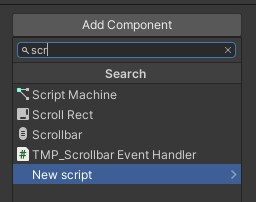
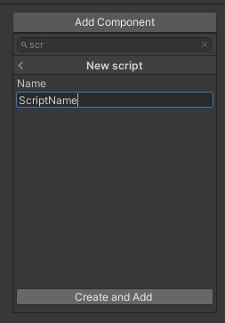

# Saving Data in Unity3D Using SQLite
<b>(Part 4 of the Persistence Comparison Series)</b>

## Introduction

Our journey of exploring options given to use when it comes persistence in Unity will in this part lead to databases. More specificaclly: SQLite.

SQLite is a C-based database that is used in many areas. It has been around for a long time and also found its way into the Unity world. During this tutorial series, we have seen options like `PlayerPrefs` in Unity, and on the other side, `File` and `BinaryWriter`/`BinaryReader` provided by the underlying .NET framework.

Here is an overview of the complete series:

- Part 1: [PlayerPrefs](https://github.com/realm/unity-examples/tree/persistence-comparison/tutorials/persistance-comparison-series/PlayerPrefs)
- Part 2: [Files](https://github.com/realm/unity-examples/blob/persistence-comparison/tutorials/persistance-comparison-series/File/file.md)
- Part 3: [BinaryReader and BinaryWriter](https://github.com/realm/unity-examples/blob/persistence-comparison/tutorials/persistance-comparison-series/BinaryWriterReader/binary_reader_writer.md)
- Part 4: SQL *(this tutorial)*
- Part 5: Realm Unity SDK *(coming soon)*
- Part 6: Comparison of all these options

Similar to the previous parts, this tutorial can also be found in our [Unity examples repository](https://github.com/realm/unity-examples) on the [persistence-comparison](https://github.com/realm/unity-examples/tree/persistence-comparison) branch.


Each part is sorted into a folder. The three scripts we will be looking at in this tutorial are in the `SQLite` sub folder. But first, let's look at the example game itself and what we have to prepare in Unity before we can jump into the actual coding.

## Example game

*Note that if you have worked through any of the other tutorials in this series, you can skip this section since we're using the same example for all parts of the series, so that it's easier to see the differences between the approaches.*

The goal of this tutorial series is to show you a quick and easy way to make some first steps in the various ways to persist data in your game.

Therefore, the example we'll be using will be as simple as possible in the editor itself so that we can fully focus on the actual code we need to write.


A simple capsule in the scene will be used so that we can interact with a game object. We then register clicks on the capsule and persist the hit count.


When you open up a clean 3D template, all you need to do is choose `GameObject` -> `3D Object` -> `Capsule`.

You can then add scripts to the capsule by activating it in the hierarchy and using `Add Component` in the inspector.




The scripts we will add to this capsule showcasing the different methods will all have the same basic structure that can be found in `HitCountExample.cs`.

```cs
using UnityEngine;

/// <summary>
/// This script shows the basic structure of all other scripts.
/// </summary>
public class HitCountExample : MonoBehaviour
{
    // Keep count of the clicks.
    [SerializeField] private int hitCount; // 1

    private void Start() // 2
    {
        // Read the persisted data and set the initial hit count.
        hitCount = 0; // 3
    }

    private void OnMouseDown() // 4
    {
        // Increment the hit count on each click and save the data.
        hitCount++; // 5
    }
}
```

The first thing we need to add is a counter for the clicks on the capsule (1). Add a `[SerilizeField]` here so that you can observe it while clicking on the capsule in the Unity editor.

Whenever the game starts (2), we want to read the current hit count from the persistence and initialize `hitCount` accordingly (3). This is done in the `Start()` method that is called whenever a scene is loaded for each game object this script is attached to.

The second part to this is saving changes, which we want to do whenever we register a mouse click. The Unity message for this is `OnMouseDown()` (4). This method gets called every time the `GameObject` that this script is attached to is clicked (with a left mouse click). In this case, we increment the `hitCount` (5) which will eventually be saved by the various options shown in this tutorials series.

## SQLite

(See `SqliteExampleSimple.cs` in the repository for the finished version.)

Now let's make sure our hit count gets persisted so we can continue playing the next time we start the game.

SQLite is not included per default in a new Unity project and is also not available directly via the Unity package manager. We have to install two components to start using it.

First, head over to [https://sqlite.org/download.html](https://sqlite.org/download.html) and choose the `Precompiled Binaries` for your operating system. Unzip it and add the two files—`sqlite3.def` and `sqlite3.dll`—to the `Plugin` folder in your Unity project.

Then, open a file explorer in your Unity Hub installation directory, and head to the following sub directory:

```
Unity/Hub/Editor/2021.2.11f1/Editor/Data/MonoBleedingEdge/lib/mono/unity
```

In there, you will find the file `Mono.Data.Sqlite.dll` which also needs to be moved to the `Plugins` folder in your Unity project. The result when going back to the Editor should look like this:


Now that the preparations are finished, we want to add our first script to the capsule. Similar to the `HitCountExample.cs`, create a new `C# script` and name it `SqliteExampleSimple`.

When opening it, the first thing we want to do is import SQLite by adding `using Mono.Data.Sqlite;` and `using System.Data;` at the top of the file (1).

Next we will look at how to save whenever the hit count is changed, which happens during `OnMouseDown()`. First we need to open a connection to the database. This is offered by the SQLite library via the [`IDbConnection`](https://docs.microsoft.com/en-us/dotnet/api/system.data.idbconnection?view=net-6.0) class (2) which represents an open connection to the database. Since we will need a connection for loading the data later on again, we will extract opening a database connection into another function and call it `private IDbConnection CreateAndOpenDatabase()` (3).

In there, we first define a name for our database file. I'll just call it `MyDatabase` for now. Accordingly, the URI should be `"URI=file:MyDatabase.sqlite"` (4). Then we can create a connection to this database using `new SqliteConnection(dbUri)` (5) and open it with `dbConnection.Open()` (6).

```cs
using Mono.Data.Sqlite; // 1
using System.Data; // 1
using UnityEngine;

public class SqliteExampleSimple : MonoBehaviour
{
    // Resources:
    // https://www.mono-project.com/docs/database-access/providers/sqlite/

    [SerializeField] private int hitCount = 0;

    void Start() // 13
    {
        // Read all values from the table.
        IDbConnection dbConnection = CreateAndOpenDatabase(); // 14
        IDbCommand dbCommandReadValues = dbConnection.CreateCommand(); // 15
        dbCommandReadValues.CommandText = "SELECT * FROM HitCountTableSimple"; // 16
        IDataReader dataReader = dbCommandReadValues.ExecuteReader(); // 17

        while (dataReader.Read()) // 18
        {
            // The `id` has index 0, our `hits` have the index 1.
            hitCount = dataReader.GetInt32(1); // 19
        }

        // Remember to always close the connection at the end.
        dbConnection.Close(); // 20
    }

    private void OnMouseDown()
    {
        hitCount++;

        // Insert hits into the table.
        IDbConnection dbConnection = CreateAndOpenDatabase(); // 2
        IDbCommand dbCommandInsertValue = dbConnection.CreateCommand(); // 9
        dbCommandInsertValue.CommandText = "INSERT OR REPLACE INTO HitCountTableSimple (id, hits) VALUES (0, " + hitCount + ")"; // 10
        dbCommandInsertValue.ExecuteNonQuery(); // 11

        // Remember to always close the connection at the end.
        dbConnection.Close(); // 12
    }

    private IDbConnection CreateAndOpenDatabase() // 3
    {
        // Open a connection to the database.
        string dbUri = "URI=file:MyDatabase.sqlite"; // 4
        IDbConnection dbConnection = new SqliteConnection(dbUri); // 5
        dbConnection.Open(); // 6

        // Create a table for the hit count in the database if it does not exist yet.
        IDbCommand dbCommandCreateTable = dbConnection.CreateCommand(); // 6
        dbCommandCreateTable.CommandText = "CREATE TABLE IF NOT EXISTS HitCountTableSimple (id INTEGER PRIMARY KEY, hits INTEGER)"; // 7
        dbCommandCreateTable.ExecuteReader(); // 8

        return dbConnection;
    }
}
```

Now we can work with this SQLite database. Before we can actually add data to it, though, we need to set up a structure. This means creating and defining tables, which is the way most databases are organized. The following screenshot shows the final state we will create in this example.


When accessing or modifying the database, we use [`IDbCommand`](https://docs.microsoft.com/en-us/dotnet/api/system.data.idbcommand?view=net-6.0) (6), which represents an SQL statement that can be executed on a database.

Let's create a new table and define some columns using the following command (7):

```sql
"CREATE TABLE IF NOT EXISTS HitCountTableSimple (id INTEGER PRIMARY KEY, hits INTEGER )"
```

So, what does this statement mean? First, we need to state what we want to do, which is `CREATE TABLE IF NOT EXISTS`. Then, we need to name this table, which will just be the same as the script we are working on right now: `HitCountTableSimple`.

Last but not least, we need to define how this new table is supposed to look. This is done by naming all columns as a tuple: `(id INTEGER PRIMARY KEY, hits INTEGER )`. The first one defines a column `id` of type `INTEGER` which is our `PRIMARY KEY`. The second one defines a column `hits` of type `INTEGER`.

After assigning this statement as the `CommandText`, we need to call `ExecuteReader()` (8) on `dbCommandCreateTable` to run it.

Now back to `OnMouseClicked()`. With the `dbConnection` created, we can now go ahead and define another `IDbCommand` (9) to modify the new table we just created and add some data. This time, the `CommandText` (10) will be:

```sql
"INSERT OR REPLACE INTO HitCountTableSimple (id, hits) VALUES (0, " + hitCount + ")"
```

Let's decipher this one too: `INSERT OR REPLACE INTO` adds a new variable to a table or updates it, if it already exists. Next is the table name that we want to insert into, `HitCountTableSimple`. This is followed by a tuple of columns that we would like to change, `(id, hits)`. The statement `VALUES (0, " + hitCount + ")` then defines values that should be inserted, also as a tuple. In this case, we just choose `0` for the key and use whatever the current `hitCount` is as the value.

Opposed to creating the table, we execute this command calling `ExecuteNonQuery()` (11) on it.

The difference can be defined as follows:

> ExecuteReader is used for any result set with multiple rows/columns (e.g., SELECT col1, col2 from sometable). ExecuteNonQuery is typically used for SQL statements without results (e.g., UPDATE, INSERT, etc.).

All that's left to do is to properly `Close()` (12) the database.

How can we actually verify that this worked out before we continue on to reading the values from the database again? Well, the easiest way would be to just look into the database. There are many tools out there to achieve this. One of the open source options would be [https://sqlitebrowser.org/](https://sqlitebrowser.org/).

After downloading and installing it, all you need to do is `File -> Open Database`, and then browse to your Unity project and select the `MyDatabase.sqlite` file. If you then choose the `Table` `HitCountTableSimple`, the result should look something like this:


Go ahead and run your game. Click a couple times on the capsule and check the Inspector for the change. When you then go back to the DB browser and click refresh, the same number should appear in the `value` column of the table.

The next time we start the game, we want to load this hit count from the database again. We use the `Start()` function (13) since it only needs to be done when the scene loads. As before, we need to get a hold of the database with an `IDbConnection` (14) and create a new `IDbCommand` (15) to read the data. Since there is only one table and one value, it's quite simple for now. We can just read `all data` by using:  

```sql
"SELECT * FROM HitCountTableSimple"
```

In this case, `SELECT` stands for `read the following values`, followed by a `*` which indicates to read all the data. The keyword `FROM` then specifies the table that should be read from, which is again `HitCountTableSimple`. Finally, we execute this command using `ExecuteReader()` (17) since we expect data back. This data is saved in an [`IDataReader`](https://docs.microsoft.com/en-us/dotnet/api/system.data.idatareader?view=net-6.0), from the documentation:

> Provides a means of reading one or more forward-only streams of result sets obtained by executing a command at a data source, and is implemented by .NET data providers that access relational databases.

`IDataReader` addresses its content in an index fashion, where the ordering matches one of the columns in the SQL table. So in our case, `id` has index 0, and `hitCount` has index 1. The way this data is read is row by row. Each time we call `dataReader.Read()` (18), we read another row from the table. Since we know there is only one row in the table, we can just assign the `value` of that row to the `hitCount` using its index 1. The `value` is of type `INTEGER` so we need to use [`GetInt32(1)`](https://docs.microsoft.com/en-us/dotnet/api/system.data.idatarecord.getint32?view=net-6.0) to read it and specify the index of the field we want to read as a parameter, `id` being `0` and `value` being `1`.

As before, in the end, we want to properly `Close()` the database (20).

When you restart the game again, you should now see an initial value for `hitCount` that is read from the database.

## Extended example

(See `SqliteExampleExtended.cs` in the repository for the finished version.)

In the previous section, we looked at the most simple version of a database example you can think of. One table, one row, and only one value we're interested in. Even though a database like SQLite can deal with any kind of complexity, we want to be able to compare it to the previous parts of this tutorial series and will therefore look at the same `Extended example`, using three hit counts instead of one and using modifier keys to identify them: `Shift` and `Control`.

Let's start by creating a new script `SqliteExampleExtended.cs` and attach it to the capsule. Copy over the code from `SqliteExampleSimple` and apply the following changes to it. First, defie the three hit counts:

```cs
[SerializeField] private int hitCountUnmodified = 0;
[SerializeField] private int hitCountShift = 0;
[SerializeField] private int hitCountControl = 0;
```

Detecting which key is pressed (in addition to the mouse click) can be done using the [`Input`](https://docs.unity3d.com/ScriptReference/Input.html) class that is part of the Unity SDK. Calling `Input.GetKey()`, we can check if a certain key was pressed. This has to be done during `Update()` which is the Unity function that is called each frame. The reason for this is stated in the documentation:

> Note: Input flags are not reset until Update. You should make all the Input calls in the Update Loop.

The key that was pressed needs to be remembered when recieving the `OnMouseDown()` event. Hence, we need to add a private field to save it like so:  

```cs
private KeyCode modifier = default;
```

Now the `Update()` function can look like this:

```cs
private void Update()
{
    // Check if a key was pressed.
    if (Input.GetKey(KeyCode.LeftShift)) // 1
    {
        // Set the LeftShift key.
        modifier = KeyCode.LeftShift; // 2
    }
    else if (Input.GetKey(KeyCode.LeftControl)) // 1
    {
        // Set the LeftControl key.
        modifier = KeyCode.LeftControl; // 2
    }
    else // 3
    {
        // In any other case reset to default and consider it unmodified.
        modifier = default; // 4
    }
}
```

First, we check if the `LeftShift` or `LeftControl` key was pressed (1) and if so, save the corresponding `KeyCode` in `modifier`. Note that you can use the `string` name of the key that you are looking for or the more type-safe `KeyCode` enum.

In case neither of those two keys were pressed (3), we define this as the `unmodified` state and just set `modifier` back to its `default` (4).

Before we continue on to `OnMouseClicked()`, you might ask what changes we need to make in the database structure that is created by `private IDbConnection CreateAndOpenDatabase()`. It turns out we actually don't need to change anything at all. We will just use the `id` introduced in the previous section and save the `KeyCode` (which is an integer) in it.

To be able to compare both versions later on, we will change the table name though and call it `HitCountTableExtended`:

```cs
dbCommandCreateTable.CommandText = "CREATE TABLE IF NOT EXISTS HitCountTableExtended (id INTEGER PRIMARY KEY, hits INTEGER)";
```

Now, let's look at how detecting mouse clicks needs to be modified to account for those keys:

```cs
private void OnMouseDown()
{
    var hitCount = 0;
    switch (modifier) // 1
    {
        case KeyCode.LeftShift:
            // Increment the hit count and set it to PlayerPrefs.
            hitCount = ++hitCountShift; // 2
            break;
        case KeyCode.LeftControl:
            // Increment the hit count and set it to PlayerPrefs.
            hitCount = ++hitCountControl; // 2
            break;
        default:
            // Increment the hit count and set it to PlayerPrefs.
            hitCount = ++hitCountUnmodified; // 2
            break;
    }

    // Insert a value into the table.
    IDbConnection dbConnection = CreateAndOpenDatabase();
    IDbCommand dbCommandInsertValue = dbConnection.CreateCommand();
    dbCommandInsertValue.CommandText = "INSERT OR REPLACE INTO HitCountTableExtended (id, hits) VALUES (" + (int)modifier + ", " + hitCount + ")";
    dbCommandInsertValue.ExecuteNonQuery();

    // Remember to always close the connection at the end.
    dbConnection.Close();
}
```

First, we need to check which modifier was used in the last frame (1). Depending on this, we increment the corresponding hit count and assign it to the local variable `hitCount` (2). As before, we count any other key than `LeftShift` and `LeftControl` as `unmodified`.

Now, all we need to change in the second part of this function is the `id` that we set statically  to `0` before and instead use the `KeyCode`. The updated SQL statement should look like this:

```sql
"INSERT OR REPLACE INTO HitCountTableExtended (id, hits) VALUES (" + (int)modifier + ", " + hitCount + ")"
```

The `VALUES` tuple now needs to set `(int)modifier` (note that the `enum` needs to be casted to `int`) and `hitCount` as its two values.

As before, we can start the game and look at the saving part in action first. Click a couple times until the Inspector shows some numbers for all three hit counts:


Now, let's open the DB browser again and this time choose the `HitCountTableExtended` from the drop-down:


As you can see, there are three rows, with the `value` being equal to the hit counts you see in the Inspector. In the `id` column, we see the three entries for `KeyCode.None` (0), `KeyCode.LeftShift` (304), and `KeyCode.LeftControl` (306).

Finally, let's read those values from the database when restarting the game.

```cs
void Start()
{
    // Read all values from the table.
    IDbConnection dbConnection = CreateAndOpenDatabase(); // 1
    IDbCommand dbCommandReadValues = dbConnection.CreateCommand(); // 2
    dbCommandReadValues.CommandText = "SELECT * FROM HitCountTableExtended"; // 3
    IDataReader dataReader = dbCommandReadValues.ExecuteReader(); // 4

    while (dataReader.Read()) // 5
    {
        // The `id` has index 0, our `value` has the index 1.
        var id = dataReader.GetInt32(0);  // 6
        var hits = dataReader.GetInt32(1); // 7
        if (id == (int)KeyCode.LeftShift) // 8
        {
            hitCountShift = hits; // 9
        }
        else if (id == (int)KeyCode.LeftControl) // 8
        {
            hitCountControl = hits; // 9
        }
        else
        {
            hitCountUnmodified = hits; // 9
        }
    }

    // Remember to always close the connection at the end.
    dbConnection.Close();
}
```

The first part works basically unchanged by creating a `IDbConnection` (1) and a `IDbCommand` (2) and then reading all rows again with `SELECT *` (3) but this time from `HitCountTableExtended`, finished by actually executing the command with `ExecuteReader()` (4).

For the next part, we now need to read each row (5) and then check which `KeyCode` it belongs to. We grab the `id` from index `0` (6) and the `hits` from index `1` (7) as before. Then, we check the `id` against the `KeyCode` (8) and assign it to the corresponding `hitCount` (9).

Now restart the game and try it out!

## Conclusion

SQLite is one of the options when it comes to persistence. If you've read the previous tutorials, you've noticed that using it might at first seem a bit more complicated than the simple `PlayerPrefs`. You have to learn an additional "language" to be able to communicate with your database. And due to the nature of SQL not being the easiest format to read, it might seem a bit intimidating at first. But the world of databases offers a lot more than can be shown in a short tutorial like this!

One of the downsides of plain files or `PlayerPrefs` that we've seen was having data in a structured way—especially when it gets more complicated or relationships between objects should be drawn. We looked at JSON as a way to improve that situation but as soon as we need to change the format and migrate our structure, it gets quite complicated. Encryption is another topic that might be important for you — `PlayerPrefs` and `File` are not safe and can easily be read. Those are just some of the areas a database like SQLite might help you achieve the requirements you have for persisting your data.

In the next tutorial, we will look at another database, the Realm Unity SDK, which offers similar advantages to SQLite, while being very easy to use at the same time.

Please provide feedback and ask any questions in the [Realm Community Forum](https://www.mongodb.com/community/forums/tags/c/realm/realm-sdks/58/unity).